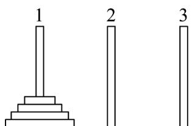

<!-- question-source:start -->
22. 如图所示，有三根针和套在一根针上的若干金属片，按下列规则，把金属片从一根针上全部移到另一根针上。

(1) 每次只移动 $^{1}$ 个金属片；

(2) 较大的金属片不能放在较小的金属片上面；

试推测：把 $n$ 个金属片从1号针移动到3号针，最少需要移动\_\_\_\_次·
<!-- question-source:end -->

![[高中/课堂同步/题库/人教A版高中数学同步讲义(2026)/04_选择性必修第二册/期末/专题15 数列各类通项及求和高频题型精准突破（十大题型）（高效培优期末专项训练）/考点04_构造法求通项/questions/answers/Q00081535A1.md]]
