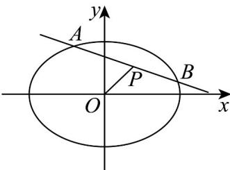

> [!faq]- 《高二数学上学期期末模拟卷_人教A版2019_高效培优_强化卷_》官方解析
>
> > [!success]- **【答案】** A
>
> > [!note]- **【解析】**
> > 椭圆 $\frac{x^2}{9} +\frac{y^2}{3} = 1$ ，由 $\frac{1^2}{9} +\frac{1^2}{3} <  1$ ，得点 $P$ 在椭圆内，
> >
> > 设 $A(x_{1},y_{1}),B(x_{2},y_{2})$ ，则 $\left\{ \begin{array}{l} \frac{x_1^2}{9} +\frac{y_1^2}{3} = 1\\ \frac{x_2^2}{9} +\frac{y_2^2}{3} = 1 \end{array} \right.$
> >
> > 两式相减得 $\frac{(x_1 + x_2)(x_1 - x_2)}{9} +\frac{(y_1 + y_2)(y_1 - y_2)}{3} = 0$ ，而 $x_{1} + x_{2} = 2,y_{1} + y_{2} = 2$
> >
> > 因此 $\frac{y_1 - y_2}{x_1 - x_2} = -\frac{1}{3}$ ，即直线 $AB$ 的斜率为 $-\frac{1}{3}$
> >
> > 所以直线 $AB$ 的方程为 $y - 1 = -\frac{1}{3} (x - 1)$ ，即 $x + 3y - 4 = 0$ 。
> >
> > 
> >
> > 故选 **A**
