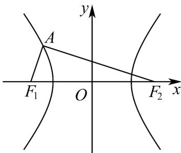

> [!faq]- 《高二数学上学期期末模拟卷_人教A版2019_高效培优_强化卷_》官方解析
>
> > [!success]- **【答案】** D
>
> > [!note]- **【解析】**
> > 因为在双曲线 C 中，因为 $\left|AF_{1}\right|=\frac{1}{3}\left|AF_{2}\right|$ ，所以 $\left|AF_{2}\right|-\left|AF_{1}\right|=2\left|AF_{1}\right|=2a$ ，
> > 则 $\left|AF_{1}\right|=a,\left|AF_{2}\right|=3a$
> >
> > 
> >
> > 在 $\triangle PF_{1}F_{2}$ 中， $AF_{1}\perp AF_{2}$ ， $\left|F_1F_2\right| = 2c$
> >
> > 所以 $\left|F_1F_2\right|^2 = \left|AF_1\right|^2 +\left|AF_2\right|^2$ ，即 $4c^{2} = 9a^{2} + a^{2}$ ，所以 $c^2 = \frac{5}{2} a^2$
> >
> > 所以 $b^{2} = c^{2} - a^{2} = \frac{3}{2} a^{2}$ ，则 $\frac{b}{a} = \sqrt{\frac{3}{2}} = \frac{\sqrt{6}}{2}$
> >
> > 所以双曲线 C 的渐近线方程为 $y = \pm \frac{\sqrt{6}}{2} x$
> >
> > 故选：D
> >
> > ## 二、选择题：本题共3小题，每小题6分，共18分．在每小题给出的选项中，有多项符合题目要求．全部选对的得6分，部分选对的得部分分，有选错的得0分.
