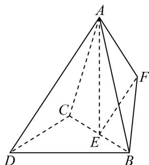

<!-- question-source:start -->
18．（17分）如图，在三棱锥 $A - BCD$ 中， $DB = DC = BC = 2$ ， $AD = \sqrt{7}$ ， $AB = \sqrt{5}$ ，平面 $ACB \perp$ 平面 $DCB, E$ 是 $BC$ 的中点.

(1)求证： $AE \perp BC$ .

(2)点 $F$ 满足 $\overline{EF} = \lambda \overline{DA}\big(0 < \lambda < 1\big)$ ，且 $CD //$ 平面 $FAB$

(i) 求 $\lambda$ 的值；

(ii) 求平面 $DAB$ 与平面 $FAB$ 的夹角的余弦值.
<!-- question-source:end -->

![[高中/课堂同步/题库/人教A版高中数学同步讲义(2026)/04_选择性必修第二册/期末/阶段测试/高二数学上学期期末模拟卷_人教A版2019_高效培优_强化卷_/四_解答题_sec_05/questions/answers/Q00061138A1.md]]
