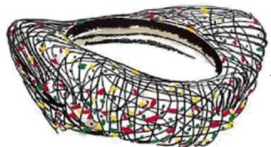

<!-- question-source:start -->
5. 在手工课上，王老师带领同学们一起制作了一个近似鸟巢的金属模型（如图），其俯视图可近似看成
是两个大小不同，扁平程度相同的椭圆·已知大椭圆的长轴长为 $40 \, cm$ ，短轴长为 $20 \, cm$ ，小椭圆的长轴长为

20cm，则小椭圆的短轴长为（）

A. $30\mathrm{cm}$ B. $20\mathrm{cm}$ C. $10\sqrt{3}\mathrm{cm}$ D. $10\mathrm{cm}$
<!-- question-source:end -->

![[高中/课堂同步/题库/人教A版高中数学同步讲义(2026)/04_选择性必修第二册/期末/阶段测试/高二数学上学期期末模拟卷_人教A版2019_高效培优_提升卷_/一_选择题_sec_02/questions/answers/Q00061143A1.md]]
