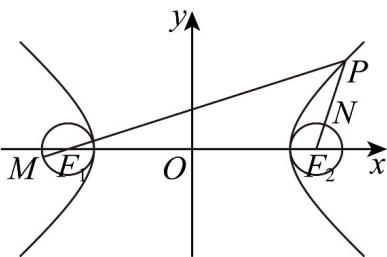

> [!faq]- 《高二数学上学期期末模拟卷_人教A版2019_高效培优_提升卷_》官方解析
>
> > [!success]- **【答案】** D
>
> > [!note]- **【解析】**
> > ∵ 双曲线方程为 $\frac{x^{2}}{16}-\frac{y^{2}}{9}=1$ ，则 $a^{2}=16, b^{2}=9, c^{2}=a^{2}+b^{2}=25, a, b, c>0$ ，
> > ∴ a=4, b=3, c=5 $\therefore F_{1}(-5,0), F_{2}(5,0)$ $\left|PF_{1}\right|-\left|PF_{2}\right|=2a=8$ 又∵ M、N 分别是圆 $(x+5)^{2}+y^{2}=1$ 和 $(x-5)^{2}+y^{2}=1$ 上的点，
> > 即 M、N 在以 $F_{1}(-5,0), F_{2}(5,0)$ 为圆心，半径为 $r_{1}=r_{2}=1$ 的圆上， $\therefore \left|PM\right|_{\max} = \left|PF_{1}\right| + r_{1} = \left|PF_{1}\right| + 1, \left|PN\right|_{\min} = \left|PF_{2}\right| - r_{2} = \left|PF_{2}\right| - 1$ $\therefore |PM| - |PN| \leq |PM|_{\max} - |PN|_{\min} = |PF_{1}| + 1 - (|PF_{2}| - 1) = |PF_{1}| - |PF_{2}| + 2 = 8 + 2 = 10$
> >
> > 故选：D.
> >
> > 
