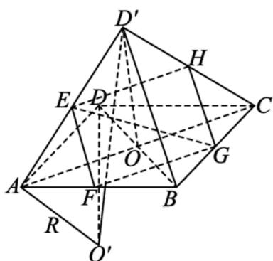

> [!faq]- 《高二数学上学期期末模拟卷_人教A版2019_高效培优_提升卷_》官方解析
>
> > [!success]- **【答案】** B
>
> > [!note]- **【解析】**
> > 因为四边形 ABCD 为菱形，所以 $AC \perp BD$ ，故 $AC \perp BO$ ， $AC \perp D'O$ ，
> >
> > 又 $B O \cap D^{\prime}O = O$ 且都在平面 $D^{\prime}OB$ 内，所以 $AC \perp$ 平面 $D^{\prime}OB$ ，因为 $BD^{\prime} \subset$ 平面 $D^{\prime}OB$ ，所以 $AC \perp BD^{\prime}$
> > - **①**：由上得 $AC \perp$ 平面 $D'OB$ ， $AC \subset$ 平面 ABC，所以平面 $D'OB \perp$ 平面 ABC，
> >
> > 当 $D^{\prime}$ 到平面 $ABC$ 的距离最大时，即 $D^{\prime}O \perp$ 平面 $ABC$ 时三棱锥 $D^{\prime} - ABC$ 的高最大，
> >
> > 由题意得， $\triangle ABD$ 为等边三角形， $O$ 为 $BD$ 中点，所以 $D'O = DO = \frac{1}{2} BD = \frac{1}{2} AB = 1$
> >
> > 则三棱锥 $D^{\prime} - ABC$ 体积的最大值为 $V = \frac{1}{3} S_{\triangle ABC}\cdot D'O = \frac{1}{3}\times \frac{1}{2}\times 2^{2}\times \sin 120^{\circ}\times 1 = \frac{\sqrt{3}}{3}$ ，①正确；
> > - **②**：取 $D^{\prime}C$ 中点 $H$ ，连接 $EH, GH$ ，因为线段 $AD^{\prime}, AB, BC$ 的中点分别为 $E, F, G$ ，
> >
> > 所以 $GH \parallel D'B \parallel EF, EH \parallel AC \parallel FG$ ，且 $GH = EF = \frac{1}{2} D'B, EH = FG = \frac{1}{2} AC$ ，
> >
> > 所以截面图形为平行四边形 $EFGH$ ：
> >
> > 由上可知 $AC \perp BD'$ ，所以 $EF \perp FG$ ，故四边形 EFGH 为矩形，
> >
> > 由题意得 $AC = 2\sqrt{3}, BD = 2$ ，所以 $D'B < OB + OD' = BD = 2 < AC = 2\sqrt{3}$
> >
> > 所以 $EF \neq FG$ ，即四边形 EFGH 一定不是正方形，②错误；
> > - **③**：当二面角 $D' - AC - B$ 为 $\frac{2\pi}{3}$ 时，由①可得 $\angle D'OB = \frac{2\pi}{3}$ ，
> >
> > 所以 $D^{\phi}$ 到平面 $ABC$ 的距离为 $OD' \sin 60^{\circ} = \frac{\sqrt{3}}{2}$
> >
> > $OD'$ 在平面 $ABC$ 内的投影在直线 $DO$ 上，投影长为 $OD' \cos 60^{\circ} = \frac{1}{2}$
> >
> > 因为 DA = DB = DC ，所以 D 为 VABC 外接圆圆心，
> >
> > 所以三棱锥 $D' - ABC$ 外接球的球心 $O'$ 在过 D 且与平面 ABC 垂直的直线上，
> >
> > 如图，
> >
> > 
> >
> > 设三棱锥 $D' - ABC$ 外接球的半径为 R， $O'D = h$ ，则 $\left\{ \begin{array}{l} R^2 = 4 + h^2 \\ R^2 = \frac{1}{4} + \left(h + \frac{\sqrt{3}}{2}\right)^2 \end{array} \right.$ ，解得 $\left\{ \begin{array}{l} h = \sqrt{3} \\ R = \sqrt{7} \end{array} \right.$ ，故三棱锥外接球的半径为 $\sqrt{7}$ ，③错误。
> >
> > 则有 1 个正确的结论.
> >
> > 故选：B
> >
> > ## 二、选择题：本题共3小题，每小题6分，共18分．在每小题给出的选项中，有多项符合题目要求．全部选对的得6分，部分选对的得部分分，有选错的得0分.
