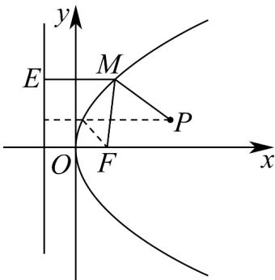

> [!faq]- 《高二数学上学期期末模拟卷_人教A版2019_高效培优_提升卷_》官方解析
>
> > [!success]- **【答案】** ABC
>
> > [!note]- **【解析】**
> > 对于A选项，抛物线 $y^{2} = 4x$ 的焦点为 $F(1,0)$ ，准线方程为 $x = -1$
> >
> > 所以焦点 F 到准线的距离是 $1+1=2$ ，A 对；
> >
> > 对于 B 选项，设点 $M(x_{1},y_{1})$ 、 $N(x_{2},y_{2})$
> >
> > 若直线 $MN$ 与 $x$ 轴重合，此时该直线与抛物线 $y^{2} = 4x$ 只有一个交点，不符合题意，
> >
> > 易知点 $F(1,0)$ ，设直线 $MN$ 的方程为 $x = my + 1$
> >
> > 联立 $\left\{\begin{aligned}x&=my+1\\ y^{2}&=4x\end{aligned}\right.$ 可得 $y^{2}-4my-4=0$ ，则 $\Delta=16m^{2}+16>0$ ，
> >
> > 由韦达定理可得 $y_{1} + y_{2} = 4m$ ， $y_{1}y_{2} = -4$
> >
> > 所以 $S_{\triangle OMN} = \frac{1}{2}\left|OF\right|\cdot \left|y_1 - y_2\right| = \frac{1}{2}\left|y_1 + \frac{4}{y_1}\right| = \frac{1}{2}\left(\left|y_1\right| + \frac{4}{\left|y_1\right|}\right)\quad \frac{1}{2}\times 2\sqrt{\left|y_1\right|\cdot\frac{4}{\left|y_1\right|}} = 2$
> >
> > 当且仅当 $\left|y_{1}\right|=\frac{4}{\left|y_{1}\right|}$ 时，即当 $y_{1}=\pm2$ 时，等号成立，故 $\triangle QMN$ 面积的最小值是2，B对；
> >
> > 对于C选项，过点 $M$ 作抛物线准线的垂线 $ME$ ，垂足为点 $E$ ，如下图所示：
> >
> > 
> >
> > 由抛物线的定义可得 $\left|MF\right|=\left|ME\right|$ ，所以 $\left|MP\right|+\left|MF\right|=\left|MP\right|+\left|ME\right|$ ，
> >
> > 故当点 $P$ 、 $M$ 、 $E$ 共线时，即当 $PE$ 与抛物线准线 $x = -1$ 垂直时， $\left|MP\right| + \left|MF\right|$ 取最小值 $3 + 1 = 4$ ，C对；对于D选项，若 $P(3,1)$ 为线段 $MN$ 的中点，则 $y_{1} + y_{2} = 4m = 2$ ，解得 $m = \frac{1}{2}$
> >
> > 此时，直线 $MN$ 的方程为 $x = \frac{1}{2} y + 1$ ，即 $y = 2x - 2$ ，故直线 $MN$ 的斜率为 $2$ ，
> >
> > 又因为 $k_{PF} = \frac{1 - 0}{3 - 1} = \frac{1}{2}$ ，则 $k_{PF} \neq k_{MN}$ ，不合乎题意，故点 $P$ 不可能为线段 $MN$ 的中点，D错.
> >
> > 故选 **ABC**.
