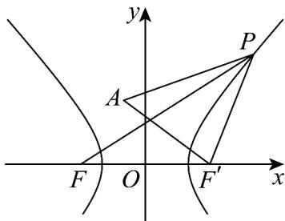

> [!faq]- 《高二数学上学期期末模拟卷_人教A版2019_高效培优_提升卷_》官方解析
>
> > [!success]- **【答案】** 9
>
> > [!note]- **【解析】**
> > 由双曲线 $C$ 的虚半轴长为 $\sqrt{5}$ ，有 $\sqrt{m + 1} = \sqrt{5}$ ，可得 $m = 4$
> >
> > 可得双曲线 C 的方程为 $\frac{x^{2}}{4}-\frac{y^{2}}{5}=1$ ，可得 $F(-3,0)$ ，实轴长为 4，
> >
> > 
> >
> > 设双曲线的右焦点为 $F'$ ，则 $F'(3,0)$ ，
> >
> > 由双曲线的性质有 $\left|PF\right| + \left|PA\right| = \left|PF'\right| + \left|PA\right| + 4$ $\left|AF'\right| + 4 = \sqrt{(3 + 1)^2 + 3^2} + 4 = 9$
> >
> > 当且仅当点 P 在线段 $AF'$ 上时等号成立，
> >
> > 故 $\left|PF\right|+\left|PA\right|$ 的最小值为9.
> >
> > 故答案为：9
> >
> > 四、解答题：本题共5小题，共77分。解答应写出文字说明、证明过程或演算步骤。
