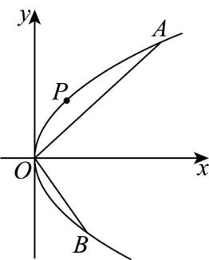

> [!faq]- 《高二数学上学期期末模拟卷_人教A版2019_高效培优_提升卷_》官方解析
>
> > [!success]- **【答案】** (1) $y^{2}=2x$ ，焦点坐标为 $\left(\frac{1}{2},0\right)$ ，准线方程为 $x=-\frac{1}{2}$ .(2)4
>
> > [!note]- **【解析】**
> > （1）由抛物线 $C:y^{2} = 2px$ 经过点 $P(2,2)$ 知， $4p = 4$ ，解得 $p = 1$ ，则抛物线 $C$ 的方程为 $y^{2} = 2x$
> >
> > 即得抛物线 $C$ 的焦点坐标为 $\left(\frac{1}{2},0\right)$ ，准线方程为 $x = -\frac{1}{2}$
> >
> > (2) 由题意知，直线 AB 不与 y 轴垂直，设直线 AB: x = ty + a，由 $\left\{\begin{aligned}y^{2}&=2x,\text{消去}x\end{aligned}\right.$
> >
> > $$
> > \left\{ \begin{array}{l} x = t y + a, \\ y ^ {2} = 2 x, \end{array} \right.
> > $$
> >
> > 得 $y^{2}-2ty-2a=0$ ， $\Delta=4t^{2}+8a$
> >
> > 设 $A(x_{1},y_{1})$ ， $B(x_{2},y_{2})$ ，则 $y_{1}+y_{2}=2t$ ， $y_{1}y_{2}=-2a$
> >
> > 因为 $OA \perp OB$ ，所以 $x_{1}x_{2} + y_{1}y_{2} = 0$ ，即 $\frac{y_{1}^{2}y_{2}^{2}}{4} + y_{1}y_{2} = 0$
> >
> > 解得 $y_{1}y_{2}=0$ （舍去）或 $y_{1}y_{2}=-4$
> >
> > 所以 -2a = -4 ，解得 a = 2 。满足 $\Delta > 0$
> >
> > 所以直线 $AB: x = ty + 2$
> >
> > 当 y=0 时，x=2 与 t 无关，所以直线 AB 过定点 $(2,0)$ ，设定点为 $C(2,0)$ ，则 VAOB 的面积为
> >
> > $$
> > S _ {\triangle A O B} = S _ {\triangle A O C} + S _ {\triangle B O C} = \frac {1}{2} \cdot | O C | \cdot | y _ {1} - y _ {2} | = \frac {1}{2} \times 2 \times | y _ {1} - y _ {2} | = \sqrt {y _ {1} ^ {2} + y _ {2} ^ {2} - 2 y _ {1} y _ {2}} = \sqrt {y _ {1} ^ {2} + y _ {2} ^ {2} + 8} \quad \sqrt {2 | y _ {1} y _ {2} | + 8} = 4
> > $$
> >
> > 当且仅当 $y_{1}=2$ ， $y_{2}=-2$ 或 $y_{1}=-2$ ， $y_{2}=2$ 时，等号成立，
> >
> > 所以 VAOB 面积的最小值为 4 .
> >
> > 
