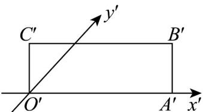

> [!faq]- 《高二数学上学期期末模拟卷（选择性必修第一册 选择性必修第二册数列，高效培优·强化卷）》官方解析
>
> > [!success]- **【答案】**  A.4 B. $4\sqrt{2}$ C.8 D. $8\sqrt{2}$
>
> > [!note]- **【解析】**
> > 依题意，矩形 $O'A'B'C'$ 的面积 $S' = O'A' \cdot O'C' = 4$
> >
> > 而斜二测画法中直观图面积是原图形面积的 $\frac{\sqrt{2}}{4}$
> >
> > 所以 $\square OABC$ 的面积为 $8\sqrt{2}$
> >
> > 故选 **D**
