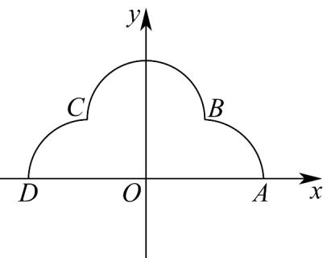

> [!faq]- 《高二数学上学期期末模拟卷（选择性必修第一册 选择性必修第二册数列，高效培优·强化卷）》官方解析
>
> > [!success]- **【答案】**  A. $\sqrt{2}$ B. $\frac{\sqrt{2}}{2}$ C. $\frac{2\sqrt{2}}{3}$ D. $\frac{\sqrt{2}}{3}$
>
> > [!note]- **【解析】**
> > 由题意可得圆 $O_{1}$ 的方程为 $(x + 1)^{2} + y^{2} = 1$ ，圆 $O_{2}$ 的方程为 $x^{2} + (y - 1)^{2} = 1$
> >
> > 圆 $O_{3}$ 的方程为 $(x - 1)^{2} + y^{2} = 1$
> >
> > 圆 $O_{2}$ 与圆 $O_{3}$ 的相交弦所在直线方程为 x-y=0 ;
> >
> > $O_{1}(-1,0)$ 到直线 $x - y = 0$ 的距离为 $d = \frac{1}{\sqrt{2}} = \frac{\sqrt{2}}{2}$
> >
> > 所以圆 $O_{2}$ 与圆 $O_{3}$ 的相交弦所在直线被圆 $O_{1}$ 截得的弦长为 $2\sqrt{1 - d^2} = 2\sqrt{1 - \left(\frac{\sqrt{2}}{2}\right)^2} = \sqrt{2}$
> >
> > 故选 **A**
