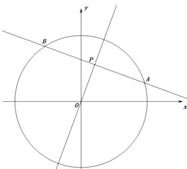

> [!faq]- 《高二数学上学期期末模拟卷（选择性必修第一册 选择性必修第二册数列，高效培优·强化卷）》官方解析
>
> > [!success]- **【答案】** C
>
> > [!note]- **【解析】**
> > 
> >
> > 的标准方程为，圆心为，半径，
> > ∵ $x^{2} + y^{2} - 25 = 0$ $x^{2} + y^{2} = 25$ $\therefore$ $(0,0)$ $r = 5$
> >
> > 又.点 $P\left(1,2\sqrt{2}\right)$ 到圆心的距离 $d = \sqrt{1^2 + \left(2\sqrt{2}\right)^2} = 3 < r = 5$
> >
> > ∴点 $P(1,2\sqrt{2})$ 在圆内，
> >
> > ∴ 过点 P 的最短弦长是与过点 P 的直径垂直的弦长 $\left|AB\right|$ ，则 $\left|AB\right|=a_{1}=2\sqrt{r^{2}-d^{2}}=2\sqrt{25-9}=8$ ，
> > 过点 P 的最长弦长为直径， $\therefore a_{2025}=2r=2\times5=10$
> >
> > 又∵过点 $P(1,2\sqrt{2})$ 的2025条弦长组成一个等差数列 $\left\{a_{n}\right\}$ ，
> > ∴ $2a_{1013}=a_{1}+a_{2025}=18$ ，解得 $a_{1013}=9$ ，故 C 正确。
> >
> > 故选 **C**.
