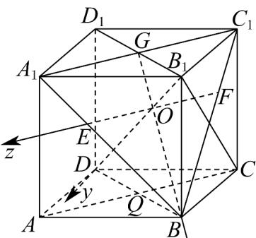
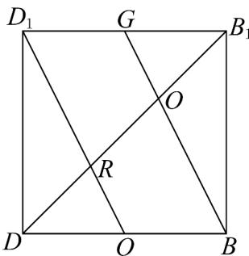
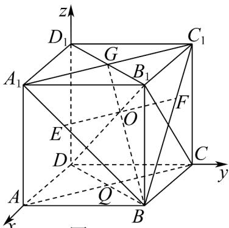

> [!faq]- 《高二数学上学期期末模拟卷（选择性必修第一册 选择性必修第二册数列，高效培优·强化卷）》官方解析
>
> > [!success]- **【答案】** A. $\lambda$ 的取值范围为 $(- \infty, 5)$ B. 若 $\lambda < -3$ ，则点 $P(-1, 0)$ 在圆 $C$ 内 C. 若 $\lambda = 3$ ，则直线 $x + y + 3 = 0$ 与圆 $C$ 相离 D. 若 $\lambda = 1$ ，圆 $C$ 关于直线 $x + y + 1 = 0$ 对称的圆 $D$ 的方程为 $x^2 + y^2 - 2x + 4y + 1 = 0$
>
> > [!note]- **【解析】**
> > $C:x^{2} + y^{2} - 2x + 4y + \lambda = 0\Leftrightarrow C:(x - 1)^{2} + (y + 2)^{2} = 5 - \lambda$ ，圆心 $C(1, - 2)$ ，半径 $r = \sqrt{5 - \lambda}$
> >
> > 对于 A：因为 $5 - \lambda > 0$ ，所以 $\lambda < 5$ ，故正确；
> >
> > 对于B：因为 $\left|CP\right| = \sqrt{4 + 4} = 2\sqrt{2}$ ， $\sqrt{5 - \lambda} >\sqrt{8} = 2\sqrt{2}$
> >
> > 所以 $\left|CP\right|<r$ ，所以点 $P(-1,0)$ 在圆 C 内，故正确；
> >
> > 对于 C：当 $\lambda=3$ 时， $r=\sqrt{2}$ ，圆心到直线的距离 $d=\frac{\left|1+(-2)+3\right|}{\sqrt{2}}=\sqrt{2}=r$
> >
> > 所以直线 $x + y + 3 = 0$ 与圆 C 相切，故错误；
> >
> > 对于D：因为 $C(1, - 2)$ 在直线 $x + y + 1 = 0$ 上，所以圆 $C$ 关于 $x + y + 1 = 0$ 的对称圆即为圆 $C$
> >
> > 所以圆 D 的方程为 $x^{2} + y^{2} - 2x + 4y + 1 = 0$ ，故正确；
> >
> > 故选：ABD.
> >
> > 10．棱长为3的正方体 $ABCD-A_{1}B_{1}C_{1}D_{1}$ 中，G为 $B_{1}D_{1}$ 中点， $B_{1}D$ 与BG交于点O，现以O为坐标原点，
> > OB为x轴正方向，垂直于平面 $BB_{1}D_{1}D$ 且沿CA方向为z轴正方向建立右手空间直角坐标系，记z轴与正方
> > 体表面交于E，F两点，则（）
> > A．y轴所在的直线垂直平面 $A_{1}BC_{1}$ B．点A的坐标为 $\left(\frac{\sqrt{6}}{2},\sqrt{3},\frac{3\sqrt{2}}{2}\right)$ C. EF = 2
> > D. A, B, C, D, E, F均在直径为 $\sqrt{19}$ 的同一个球面上
> >
> > 【答案】ABD
> >
> > $$
> > A _ {1} B, A _ {1} C _ {1}, B C _ {1}
> > $$
> >
> > $$
> > A _ {1} C _ {1} \perp B _ {1} D _ {1}
> > $$
> >
> > $$
> > B B _ {1} \perp
> > $$
> >
> > $$
> > A _ {1} B _ {1} C _ {1} D _ {1}
> > $$
> >
> > $$
> > A _ {1} C _ {1} \subset
> > $$
> >
> > $$
> > A _ {1} B _ {1} C _ {1} D _ {1}
> > $$
> >
> > $$
> > B B _ {1} \perp A _ {1} C _ {1}
> > $$
> >
> > $$
> > B _ {1} D _ {1} \mathrm{I} B B _ {1} = B _ {1}, B _ {1} D _ {1}, B B _ {1} \subset
> > $$
> >
> > $$
> > B B _ {1} D _ {1} D
> > $$
> >
> > 所以 $A_{1}C_{1} \perp$ 平面 $BB_{1}D_{1}D$ ，过 O 作 $l // A_{1}C_{1}$ ，则 $l \perp$ 平面 $BB_{1}D_{1}D$ ，
> >
> > 易知 $l$ 与 $BC_{1}$ ， $BA_{1}$ 有交点，且交点即为 $z$ 轴与正方体表面的交点，不妨设交 $A_{1}B$ 于 $E$ ，交 $BC_{1}$ 于 $F$ ，因为 $OB,OD\subset$ 平面 $BB_{1}D_{1}D$ ，所以 $OE\perp OB,OE\perp OD$ ，
> >
> > 由正方体的性质知 $B_{1}D_{1} / / BD$ ，且 $B_{1}D_{1} = BD$ ，又 $G$ 是 $B_{1}D_{1}$ 中点，则 $\frac{GB_1}{BD} = \frac{GO}{OB} = \frac{1}{2}$ 由 $l / / A_{1}C_{1}$ ，知 $\frac{EF}{A_1C_1} = \frac{2}{3}$
> >
> > 又 $DB_{1} \subset$ 平面 $BB_{1}D_{1}D$ ，所以 $A_{1}C_{1} \perp DB_{1}$ ，连接 $B_{1}C$ ，易知 $B_{1}C \perp BC_{1}$ ，
> >
> > 又由正方体的性质知 $DC \perp$ 平面 $BCC_{1}B_{1}$ ，又 $BC_{1} \subset$ 平面 $BCC_{1}B_{1}$ ，所以 $DC \perp BC_{1}$ ，
> >
> > 又 $B_{1}C \cap DC = C, B_{1}C, DC \subset$ 平面 $B_{1}DC$ ，所以 $BC_{1} \perp$ 平面 $B_{1}DC$
> >
> > 因为 $DB_{1} \subset$ 平面 $B_{1}DC$ ，所以 $BC_{1} \perp DB_{1}$ ，又 $A_{1}C_{1} \perp DB_{1}$ ， $A_{1}C_{1} \perp BC_{1} = C_{1}$ ， $A_{1}C_{1}, BC_{1} \subset$ 平面 $A_{1}C_{1}B$
> >
> > 所以 $DB_{1} \perp$ 平面 $A_{1}C_{1}B$ ，又 $OE, OB \subset$ 平面 $A_{1}C_{1}B$ ，则 $OD \perp OB, OD \perp OF$
> >
> > 则题设要求中的空间直角坐标系如图 1 所示，
> >
> > 对于 A，因为 $DB_{1} \perp$ 平面 $A_{1}BC_{1}$ ，所以 y 轴所在的直线垂直平面 $A_{1}BC_{1}$ ，故 A 正确，
> >
> > 
> > 图 1
> >
> > 对于 B，设 $AC \cap BD = Q$ ，因为 $AC // A_{1}C_{1}$ ，所以 $AC \perp$ 平面 $BB_{1}D_{1}D$ ，且 $\left|AQ\right| = \frac{1}{2}\left|AC\right| = \frac{3\sqrt{2}}{2}$
> >
> > 如图2，在矩形 $BB_{1}D_{1}D$ 中，连接 $D_{1}Q$ ，因为 $Q$ 为 $BD$ 的中点，所以 $QD_{1} // BG$ ，且 $QD_{1} \perp DB_{1}$
> >
> > 则 $\left|QR\right|=\frac{1}{2}\left|BO\right|=\frac{1}{3}\left|BG\right|$ ， $\left|RO\right|=\frac{1}{3}\left|DB_{1}\right|$ ，又 $\left|BG\right|=\sqrt{3^{2}+\left(\frac{3\sqrt{2}}{2}\right)^{2}}=\frac{3\sqrt{6}}{2}$ ， $\left|DB_{1}\right|=\sqrt{3^{2}+3^{2}+3^{2}}=3\sqrt{3}$
> >
> > 所以 $\left|QR\right|=\frac{\sqrt{6}}{2}$ ， $\left|QR\right|=\sqrt{3}$ ，则点A的坐标为 $\left(\frac{\sqrt{6}}{2},\sqrt{3},\frac{3\sqrt{2}}{2}\right)$ ，所以B正确，
> >
> > 
> > 图2
> >
> > 对于 C，因为 $\frac{EF}{A_{1}C_{1}}=\frac{BO}{BG}=\frac{2}{3}$ ，又 $\left|A_{1}C_{1}\right|=3\sqrt{2}$ ，所以 $\left|EF\right|=2\sqrt{2}$ ，故 C 错误，
> >
> > 对于 D，如图 3，建立新的空间直角坐标系 $D - x'y'z'$
> >
> > 因为 $D(0,0,0)$ ， $A(3,0,0)$ ， $B(3,3,0)$ ， $C(0,3,0)$ ， $E(3,1,2)$ ， $F(1,3,2)$
> >
> > 假设 A, B, C, D, E, F 均在球 G 上，则球心 G 在面 ABCD 的投影为 Q，
> >
> > 设 $G\left(\frac{3}{2}, \frac{3}{2}, t\right)$ ，球 $G$ 的半径为 $R$ ，由 $|GD| = |GE| = R$ ，得到 $\sqrt{\frac{9}{4} + \frac{9}{4} + t^2} = \sqrt{\left(\frac{3}{2} - 3\right)^2 + \left(\frac{3}{2} - 1\right)^2 + (t - 2)^2}$
> >
> > 整理得到 $4t = 2$ ，解得 $t = \frac{1}{2}$ ，所以 $R = \sqrt{\frac{9}{4} + \frac{9}{4} + \frac{1}{4}} = \frac{\sqrt{19}}{2}$ ， $G\left(\frac{3}{2}, \frac{3}{2}, \frac{1}{2}\right)$
> >
> > 又 $\left|GF\right|=\sqrt{\left(\frac{3}{2}-1\right)^{2}+\left(\frac{3}{2}-3\right)^{2}+\left(\frac{1}{2}-2\right)^{2}}=\frac{\sqrt{19}}{2}$ ，且易知 $\left|GA\right|=\left|GB\right|=\left|GC\right|=\left|GD\right|$
> >
> > 所以 $A$ ， $B$ ， $C$ ， $D$ ， $E$ ， $F$ 均在直径为 $\sqrt{19}$ 的同一个球面上，故D正确，
> >
> > 
> > 图 3
> >
> > 故选 **ABD**.
