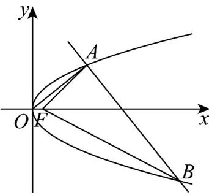
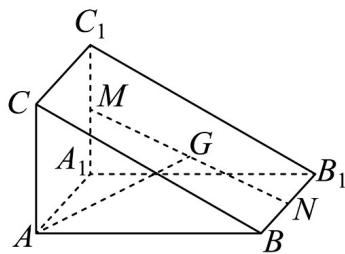
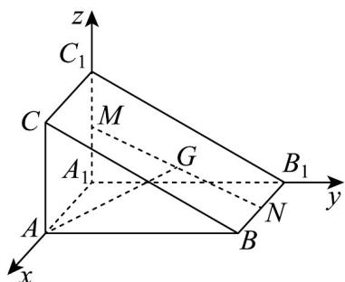

> [!faq]- 《高二数学上学期期末模拟卷（选择性必修第一册 选择性必修第二册数列，高效培优·强化卷）》官方解析
>
> > [!success]- **【答案】** $2\sqrt{2}+\frac{5}{2}$
>
> > [!note]- **【解析】**
> > 设 $OA$ 方程： $y = kx$ ，则 $\left\{ \begin{array}{l} y = kx \\ y^2 = x \end{array} \right.$ ，求得 $A\left( \frac{1}{k^2}, \frac{1}{k} \right)$
> >
> > 则 $AB$ 方程： $y - \frac{1}{k} = -\frac{1}{k}\left(x - \frac{1}{k^2}\right)$
> >
> > 所以 $\left(-\frac{1}{k} x + \frac{1}{k} + \frac{1}{k^3}\right)^2 = x$ ，即 $\left(k^2 x - k^2 - 1\right)^2 = k^6 x$
> >
> > 所以 $k^4 x^2 - (k^6 + 2k^4 + 2k^2)x + (k^2 + 1)^2 = 0$ ，解得 $x_B = \left(k + \frac{1}{k}\right)^2, y_B = -\left(k + \frac{1}{k}\right)$
> >
> > 所以 $\left|FA\right|+\left|FB\right|=\frac{1}{k^{2}}+\left(k+\frac{1}{k}\right)^{2}+\frac{1}{2}=k^{2}+\frac{2}{k^{2}}+\frac{5}{2}\quad2\sqrt{k^{2}\cdot\frac{2}{k^{2}}}+\frac{5}{2}=2\sqrt{2}+\frac{5}{2}$
> >
> > 当且仅当 $k^{2}=\frac{2}{k^{2}}$ ，即 $k=\pm2^{\frac{1}{4}}$ 时，等号成立，
> >
> > 所以 $\left|FA\right|+\left|FB\right|$ 的最小值为 $2\sqrt{2}+\frac{5}{2}$ .
> >
> > 故答案为： $2\sqrt{2}+\frac{5}{2}$
> >
> > 
> >
> > 14．《九章算术》中的“商功”篇主要讲述了以立体几何为主的各种形体体积的计算，其中堑堵是指底面为
> >
> > 【答案】
> >
> > 直角三角形的直棱柱·如图，在堑堵 $ABC-A_{1}B_{1}C_{1}$ 中，M，N分别是 $A_{1}C_{1}$ ， $BB_{1}$ 的中点，G是MN的中点·判
> >
> > 断直线 $AG$ 与平面 $A_{1}B_{1}C_{1}$ 是否相交？\_\_\_\_（填“是”或“不是”）；若 $AG = xAB + yAA_{1} + zAC$ ，则
> >
> > 
> >
> > 【答案】 是 $\frac{3}{2}$
> >
> > 【详解】以 $A_{1}$ 为原点， $A_{1}A, A_{1}B_{1}, A_{1}C_{1}$ 为 $x, y, z$ 轴正方向建系，如图所示，
> >
> > 
> >
> > 设 $A_{1}A = a, A_{1}B_{1} = b, A_{1}C_{1} = c$
> >
> > 则 $A_{1}(0,0,0), A(a,0,0), M\left(0,0,\frac{c}{2}\right), N\left(\frac{a}{2}, b,0\right)$
> >
> > 所以 $G\left(\frac{a}{4},\frac{b}{2},\frac{c}{4}\right)$
> >
> > 所以 $AG=\left(-\frac{3a}{4},\frac{b}{2},\frac{c}{4}\right),A_{1}A=(a,0,0)$
> >
> > 因为 $A_{1}A \perp$ 平面 $A_{1}B_{1}C_{1}$
> >
> > 所以 $A_{1}A$ 为平面 $A_{1}B_{1}C_{1}$ 的法向量，
> >
> > 因为 $A_{1}A \cdot AG = -\frac{3a^{2}}{4} \neq 0$
> >
> > 所以 $\overset{\cup\cup}{A_{1}}A$ 与 $\overset{\cup\cup}{AG}$ 不垂直，即直线 AG 与直线 $A_{1}A$ 不垂直，
> >
> > 所以直线 AG 与平面 $A_{1}B_{1}C_{1}$ 相交.
> >
> > 由题意 $AG=\frac{1}{2}\left(AM+AN\right)=\frac{1}{2}\left(AA_{1}+\frac{1}{2}AC+AB+\frac{1}{2}AA_{1}\right)$
> >
> > $$
> > = \frac {1}{2} A B + \frac {3}{4} A A _ {1} + \frac {1}{4} A C
> > $$
> >
> > 所以 $x=\frac{1}{2}, y=\frac{3}{4}, z=\frac{1}{4}$ ，则 $x+y+z=\frac{3}{2}$ .
> >
> > 故答案为：是； $\frac{3}{2}$
