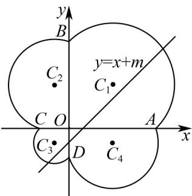

> [!faq]- 《高二数学上学期期末模拟卷（选择性必修第一册 选择性必修第二册数列，高效培优·强化卷）》官方解析
>
> > [!success]- **【答案】** (1)与x轴的交点为 $(3,0),(-1,0)$ ，与y轴的交点为 $(0,3),(0,-1)$ (2) $5\pi+8(3)\left(-2-\sqrt{5},2+\sqrt{5}\right)$
>
> > [!note]- **【解析】**
> > （1）令 $x = 0$ ，得到 $y^{2} = 2|y| + y$ ，当 $y = 0$ 时， $y^{2} = 3y$ ，解得 $y = 0$ （舍）或 $y = 3$
> >
> > 当 $y < 0$ 时， $y^2 = -y$ ，解得 $y = -1$ ，所以 $C$ 与 $y$ 轴的交点坐标 $B(0,3), D(0,-1)$ ；
> >
> > 令 y=0 ，得到 $x^{2}=2|x|+x$ ，当 x=0 时， $x^{2}=3x$ ，解得 x=0 （舍）或 x=3 ，
> >
> > 当 $x < 0$ 时， $x^2 = -x$ ，解得 $x = -1$ ，所以 $C$ 与 $x$ 轴的交点坐标 $A(3,0), C(-1,0)$
> >
> > 所以 C 与 x 轴的交点为 $(3,0)$ , $(-1,0)$ ，与 y 轴的交点为 $(0,3)$ , $(0,-1)$ ;
> >
> > (2) 当 $x = 0, y = 0$ 时，由 $x^{2} + y^{2} = 2|x| + 2|y| + x + y$ 得到 $x^{2} + y^{2} = 3x + 3y$
> >
> > 即 $\left(x - \frac{3}{2}\right)^2 +\left(y - \frac{3}{2}\right)^2 = \frac{9}{2}$
> >
> > 其图象在以 $C_{1}\left(\frac{3}{2},\frac{3}{2}\right)$ 为圆心，半径为 $r_{1}=\frac{3\sqrt{2}}{2}$ 的圆上，
> >
> > 当 $x < 0, y$ 0时，由 $x^{2} + y^{2} = 2|x| + 2|y| + x + y$ 得到 $x^{2} + y^{2} = -x + 3y$ ，即 $\left(x + \frac{1}{2}\right)^2 + \left(y - \frac{3}{2}\right)^2 = \frac{5}{2}$
> >
> > 其图象在以 $C_{2}\left(-\frac{1}{2},\frac{3}{2}\right)$ 为圆心，半径为 $r_{2}=\frac{\sqrt{10}}{2}$ 的圆上，
> >
> > 当 $x < 0, y < 0$ 时，由 $x^{2} + y^{2} = 2|x| + 2|y| + x + y$ 得到 $x^{2} + y^{2} = -x - y$ ，即 $\left(x + \frac{1}{2}\right)^2 +\left(y + \frac{1}{2}\right)^2 = \frac{1}{2}$
> >
> > 其图象在以 $C_{3}\left(-\frac{1}{2},-\frac{1}{2}\right)$ 为圆心，半径为 $r_{3}=\frac{\sqrt{2}}{2}$ 的圆上，
> >
> > 当 $x = 0, y < 0$ 时，由 $x^{2} + y^{2} = 2|x| + 2|y| + x + y$ 得到 $x^{2} + y^{2} = 3x - y$ ，即 $\left(x - \frac{3}{2}\right)^2 + \left(y + \frac{1}{2}\right)^2 = \frac{5}{2}$
> >
> > 其图象在以 $C_{4}\left(\frac{3}{2},-\frac{1}{2}\right)$ 为圆心，半径为 $r_{4}=\frac{\sqrt{10}}{2}$ 的圆上，
> >
> > 所以曲线 C 围成的图象如图所示，由（1）知 $A(3,0)$ , $C(-1,0)$ , $B(0,3)$ , $D(0,-1)$
> >
> > 又直线 $AB$ 的方程为 $\frac{x}{3} +\frac{y}{3} = 1$ ，易知 $C_1$ 直线 $AB$ 上，
> >
> > 直线 BC 的方程为 $\frac{x}{-1} + \frac{y}{3} = 1$ ，易知 $C_{2}$ 在直线 BC 上，
> >
> > 直线 CD 的方程为 $x + y = -1$ ，易知 $C_{3}$ 在直线 CD 上，
> >
> > 直线 $AD$ 的方程为 $\frac{x}{3} - y = 1$ ，易知 $C_4$ 在直线 $AD$ 上，
> >
> > 所以曲线 $C$ 围成的图形面积为4个半圆的面积及4个直角三角形的面积和，
> >
> > $$
> > S = \frac {1}{2} \pi \left(r _ {1} ^ {2} + r _ {2} ^ {2} + r _ {3} ^ {2} + r _ {4} ^ {2}\right) + S _ {\triangle A O B} + S _ {\triangle C O B} + S _ {\triangle C O D} + S _ {\triangle A O D}
> > $$
> >
> > $$
> > = \frac {1}{2} \pi \left(\frac {9}{2} + \frac {5}{2} + \frac {5}{2} + \frac {1}{2}\right) + \frac {1}{2} \times 3 \times 3 + \frac {1}{2} \times 1 \times 3 + \frac {1}{2} \times 1 \times 1 + \frac {1}{2} \times 3 \times 1 = 5 \pi + 8
> > $$
> >
> > (3) 当直线 $y = x + m$ 与圆 $\left(x - \frac{3}{2}\right)^2 + \left(y - \frac{3}{2}\right)^2 = \frac{9}{2}$ 相切时，得到 $\frac{|m|}{\sqrt{2}} = \frac{3\sqrt{2}}{2}$ ，
> >
> > 解得 $m = 3$ 或 $-3$ ，所以直线 $y = x + m$ 与圆 $\left(x - \frac{3}{2}\right)^2 +\left(y - \frac{3}{2}\right)^2 = \frac{9}{2}$ 相切时，切点为 $A(3,0),B(0,3)$
> >
> > 当直线 $y = x + m$ 与圆 $\left(x + \frac{1}{2}\right)^2 +\left(y - \frac{3}{2}\right)^2 = \frac{5}{2}$ 相切时，得到 $\frac{|m - 2|}{\sqrt{2}} = \frac{\sqrt{10}}{2}$
> >
> > 解得 $m = 2 + \sqrt{5}$ 或 $m = 2 - \sqrt{5}$ （舍），
> >
> > 当直线 $y = x + m$ 与圆 $\left(x + \frac{1}{2}\right)^2 +\left(y + \frac{1}{2}\right)^2 = \frac{1}{2}$ 相切时，得到 $\frac{|m|}{\sqrt{2}} = \frac{\sqrt{2}}{2}$
> >
> > 解得 $m = 1$ 或 $-1$ ，所以直线 $y = x + m$ 与圆 $\left(x + \frac{1}{2}\right)^2 +\left(y + \frac{1}{2}\right)^2 = \frac{1}{2}$ 相切时，切点为 $C(-1,0),D(0, - 1)$
> >
> > 当直线 $y = x + m$ 与圆 $\left(x - \frac{3}{2}\right)^{2} + \left(y + \frac{1}{2}\right)^{2} = \frac{5}{2}$ 相切时，得到 $\frac{|m + 2|}{\sqrt{2}} = \frac{\sqrt{10}}{2}$
> >
> > 解得 $m = -2 + \sqrt{5}$ （舍）或 $m = -2 - \sqrt{5}$
> >
> > 又曲线 C 不过原点，由图知，要使直线 $y = x + m$ 与 C 有且仅有两个公共点，则 $-2 - \sqrt{5} < m < 2 + \sqrt{5}$ ，
> > 所以 m 的取值范围为 $(-2 - \sqrt{5}, 2 + \sqrt{5})$ .
> >
> > 
