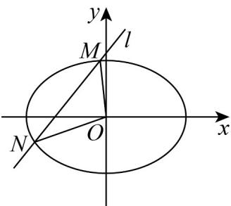

> [!faq]- 《高二数学上学期期末模拟卷（选择性必修第一册 选择性必修第二册数列，高效培优·强化卷）》官方解析
>
> > [!success]- **【答案】** (1) $\frac{\sqrt{2}}{2}$ (2) (i) $\left(\frac{4\sqrt{3}}{3},+\infty\right)$ ; (ii) $\frac{x^{2}}{6}+\frac{y^{2}}{3}=1$
>
> > [!note]- **【解析】**
> > （1）由题意可知， $\frac{2a}{2b}=\sqrt{2}$ ，即 $a^{2}=2b^{2}=2\left(a^{2}-c^{2}\right)$
> >
> > 则 $a^{2}=2c^{2}$ ，即 $a=\sqrt{2}c$ ，
> >
> > 所以椭圆 E 的离心率为 $e=\frac{c}{a}=\frac{\sqrt{2}}{2}$
> >
> > (2) (i) 由 (1) 可知，可以将椭圆 $E$ 的方程表示为 $\frac{x^2}{2c^2} + \frac{y^2}{c^2} = 1$ ，直线 $l$ 的方程为 $y = x + 2$
> >
> > 联立直线 $l$ 和椭圆 $E$ 的方程 $\left\{ \begin{array}{l} y = x + 2 \\ \frac{x^2}{2c^2} + \frac{y^2}{c^2} = 1 \end{array} \right.$ ，得 $3x^{2} + 8x + 8 - 2c^{2} = 0$ ，
> >
> > 因为 l 与 E 有两个公共点，
> >
> > 所以 $\Delta = 8^{2} - 4 \times 3(8 - 2c^{2}) = 24c^{2} - 32 > 0$ ，解得 $c > \frac{2\sqrt{3}}{3}$
> >
> > 则 $2c > \frac{4\sqrt{3}}{3}$ ，故椭圆 $E$ 的焦距的取值范围是 $\left(\frac{4\sqrt{3}}{3}, + \infty\right)$
> >
> > （ii）由题意可知直线 l 的斜率存在，设 $l: y = kx + 2$ ， $M(x_{1}, y_{1})$ ， $N(x_{2}, y_{2})$
> >
> > 联立直线 $l$ 和椭圆 $E$ 的方程 $\left\{ \begin{array}{l} y = kx + 2 \\ \frac{x^2}{2c^2} + \frac{y^2}{c^2} = 1 \end{array} \right.$ ，得 $(1 + 2k^2)x^2 + 8kx + 8 - 2c^2 = 0$ ，
> >
> > 因为 l 与 E 有两个公共点，
> >
> > 所以 $\Delta = (8k)^2 - 4(1 + 2k^2) \cdot (8 - 2c^2) = 16k^2c^2 + 8c^2 - 32 > 0$ ，化简得 $k^2 > \frac{4 - c^2}{2c^2}$
> >
> > 由韦达定理知， $x_{1} + x_{2} = -\frac{8k}{1 + 2k^{2}}$ ， $x_{1}x_{2} = \frac{8 - 2c^{2}}{1 + 2k^{2}}$
> >
> > $$
> > \text {故} \mid M N \mid = \sqrt {1 + k ^ {2}} \mid x _ {1} - x _ {2} \mid = \sqrt {1 + k ^ {2}} \sqrt {\left(x _ {1} + x _ {2}\right) ^ {2} - 4 x _ {1} x _ {2}} = \frac {2 \sqrt {2} \sqrt {1 + k ^ {2}} \sqrt {2 k ^ {2} c ^ {2} + c ^ {2} - 4}}{1 + 2 k ^ {2}}
> > $$
> >
> > 原点 O 到直线 l 的距离 $d = \frac{2}{\sqrt{1 + k^{2}}}$
> >
> > 所以 $S_{\triangle MON} = \frac{1}{2} |MN| d = \frac{1}{2} \times \frac{2\sqrt{2}\sqrt{1+k^{2}}\sqrt{2k^{2}c^{2}+c^{2}-4}}{1+2k^{2}} \times \frac{2}{\sqrt{1+k^{2}}} = \frac{2\sqrt{2}\sqrt{2k^{2}c^{2}+c^{2}-4}}{1+2k^{2}}$
> >
> > 令 $t = \sqrt{2k^2c^2 + c^2 - 4} >0$ ，得 $2k^{2} = \frac{t^{2} + 4}{c^{2}} -1$
> >
> > $S_{\triangle MON}=\frac{2\sqrt{2}t}{\frac{t^{2}+4}{c^{2}}-1+1}=\frac{2\sqrt{2}tc^{2}}{t^{2}+4}=\frac{2\sqrt{2}c^{2}}{t+\frac{4}{t}}\leq\frac{2\sqrt{2}c^{2}}{2\sqrt{t\cdot\frac{4}{t}}}=\frac{\sqrt{2}c^{2}}{2}$ ，故
> >
> > 当且仅当 $t = \frac{4}{t}$ ，即 $t = 2$ 时等号成立，则 $S_{\triangle MON}$ 有最大值 $\frac{\sqrt{2}c^2}{2}$
> >
> > 故 $\frac{\sqrt{2}c^2}{2} = \frac{3\sqrt{2}}{2}$ ，即 $c^2 = 3$ ，所以椭圆 $E$ 的方程为 $\frac{x^2}{6} +\frac{y^2}{3} = 1$
> >
> > 所以椭圆 E 的方程为 $\frac{x^{2}}{6} + \frac{y^{2}}{3} = 1$ .
> >
> > 
