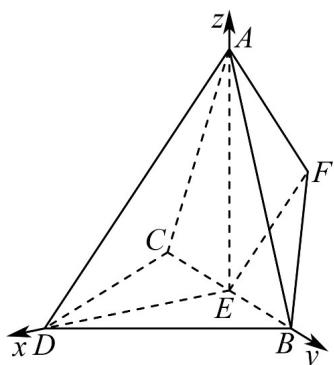

> [!faq]- 《高二数学上学期期末模拟卷（选择性必修第一册 选择性必修第二册数列，高效培优·强化卷）》官方解析
>
> > [!success]- **【答案】** (1)证明见解析(2)(i) $\lambda=\frac{1}{2}$ ; (ii) $\frac{11}{19}$ .
>
> > [!note]- **【解析】**
> > （1）连接 $DE$ ，因为 $DB = DC$ ， $E$ 是 $BC$ 的中点，所以 $DE \perp BC$ ， $DE = \sqrt{3}$
> >
> > 因为平面 $ACB \perp$ 平面 DCB ，平面 $ACB \cap$ 平面 DCB = BC ，且 $DE \subset$ 平面 DCB ，
> >
> > 所以 $DE \perp$ 平面 ACB ，
> >
> > 又因为 $AE \subset$ 平面 $ACB$ ，所以 $DE \perp AE$ 。
> >
> > 由 $AD = \sqrt{7}$ ， $DE = \sqrt{3}$ ，可得 $AE = \sqrt{AD^{2} - DE^{2}} = 2$ ，
> >
> > 又 $AB = \sqrt{5}$ ， $BE = 1$ ，所以 $AE^2 + BE^2 = AB^2$ ，故 $AE \perp BC$
> >
> > (2) (i) 由 (1) 知，ED, EB, EA 两两互相垂直，
> >
> > 以 $E$ 为坐标原点，直线 $ED, EB, EA$ 分别为 $x$ 轴、 $y$ 轴、 $z$ 轴建立如图所示的空间直角坐标系，
> >
> > 
> >
> > 则 $E(0,0,0)$ ， $D(\sqrt{3},0,0)$ ， $B(0,1,0)$ ， $A(0,0,2)$ ， $C(0,-1,0)$
> >
> > 所以 $\stackrel{\square\square\sqcup}{AE}=(0,0,-2)$ $\stackrel{\square\square\square}{DA}=\left(-\sqrt{3},0,2\right)$ $\stackrel{\square\square\square}{AB}=\left(0,1,-2\right)$ $\stackrel{\square\square\square}{CD}=\left(\sqrt{3},1,0\right)$
> >
> > 则 $\overline{AF} = \overline{AE} + \overline{EF} = \overline{AE} + \lambda \overline{DA} = (-\sqrt{3}\lambda, 0, 2\lambda - 2)$ .
> >
> > 设 $n = (x, y, z)$ 是平面 $FAB$ 的法向量，
> >
> > 由 $\left\{\begin{aligned}&n\cdot\overrightarrow{AE}=-\sqrt{3}\lambda x+(2\lambda-2)z=0,\\&n\cdot AB=y-2z=0,\end{aligned}\right.$ ，可取 $n=\left(\frac{2\lambda-2}{\sqrt{3}\lambda},2,1\right)$ .
> >
> > 因为 $CD \parallel$ 平面 $FAB$ , 所以 $CD \perp n$ ,
> >
> > 即 $CD \cdot n = \frac{2\lambda - 2}{\lambda} + 2 = 0$ ，解得 $\lambda = \frac{1}{2}$ .
> >
> > (ii) 设 $m = (a, b, c)$ 是平面 DAB 的法向量，平面 DAB 与平面 FAB 的夹角为 $\theta$ .
> >
> > $$
> > \stackrel {{\sqcup \sqcup \sqcup}} {{D B}} = (- \sqrt {3}, 1, 0) \quad \stackrel {{\sqcup \sqcup \sqcup}} {{A B}} = (0, 1, - 2)
> > $$
> >
> > 由 $\left\{\begin{aligned}&m\cdot DB=-\sqrt{3}a+b=0\\&m\cdot AB=b-2c=0\end{aligned}\right.$ ，可取 $m=\left(2,2\sqrt{3},\sqrt{3}\right)$ .
> >
> > 由(i)知，平面FAB的一个法向量为 $\vec{n}=\left(-\frac{2}{\sqrt{3}},2,1\right)$
> >
> > 所以 $\left|\cos\theta\right|=\left|\cos m,n\right|=\frac{\left|-\frac{4}{\sqrt{3}}+4\sqrt{3}+\sqrt{3}\right|}{\sqrt{4+12+3}\times\sqrt{\frac{4}{3}+4+1}}=\frac{11}{19}$
> >
> > 故平面 $DAB$ 与平面 $FAB$ 的夹角的余弦值为 $\frac{11}{19}$ .
