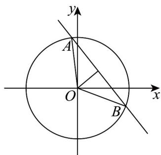

> [!faq]- 《高二数学上学期期末模拟卷（选择性必修第一册 选择性必修第二册数列，高效培优·提升卷）》官方解析
>
> > [!success]- **【答案】** A. $OM = OA + OB + OC$ B. $OM = 2OA - OB - OC$ C. $OM = \frac{1}{4}OA + \frac{1}{4}OB + \frac{1}{4}OC$ D. $OM = \frac{1}{3}OA + \frac{1}{3}OB + \frac{1}{3}OC$
>
> > [!note]- **【解析】**
> > 平面 ABC 外的任一点 O，点 M, A, B, C 共面的充要条件是 $OM = xOA + yOB + zOC$ ，且 $x + y + z = 1$ 。
> >
> > 对于 A，由 $\overline{OM} = \overline{OA} + \overline{OB} + \overline{OC}$ ，得 $1 + 1 + 1 = 3 \neq 1$ ，点 M, A, B, C 不共面，故 A 不合题意；
> >
> > 对于 B，由 $\overline{OM} = 2\overline{OA} - \overline{OB} - \overline{OC}$ ，得 $2 + (-1) + (-1) = 0 \neq 1$ ，点 M, A, B, C 不共面，故 B 不合题意；
> >
> > 对于 C，由 $\overline{OM} = \frac{1}{4}\overline{OA} + \frac{1}{4}\overline{OB} + \frac{1}{4}\overline{OC}$ ，得 $\frac{1}{4} + \frac{1}{4} + \frac{1}{4} = \frac{3}{4} \neq 1$ ，点 M, A, B, C 不共面，故 C 不合题意；
> >
> > 对于 D，由 $\overline{OM} = \frac{1}{3} \overline{OA} + \frac{1}{3} \overline{OB} + \frac{1}{3} \overline{OC}$ ，得 $\frac{1}{3} + \frac{1}{3} + \frac{1}{3} = 1$ ，点 M, A, B, C 共面，故 D 符合题意.
> >
> > 故选：D.
> >
> > 4．过点P的直线与圆 $O:x^{2}+y^{2}=4$ 交于A，B两点，若VAOB面积的最大值为 $\sqrt{3}$ ，则点P的坐标可以为
> >
> > 【答案】
> > ( )
> > A. $\left(2,\frac{1}{3}\right)$ B. $(-1,\sqrt{3})$ C. $\left(\frac{4}{5},\frac{3}{5}\right)$ D. $\left(\frac{\sqrt{2}}{2},\frac{1}{2}\right)$
> >
> > 【答案】C
> >
> > 【详解】由题意得圆 $O: x^{2} + y^{2} = 4$ 的圆心为 $O(0,0)$ ，半径 $r = 2$ 。
> >
> > 对于 A，点 $P\left(2,\frac{1}{3}\right)$ 到原点的距离 $\left|OP\right|=\sqrt{4+\frac{1}{9}}=\frac{\sqrt{37}}{3}>r$ ，可知 P 在圆外，
> >
> > 此时 $S_{\triangle AOB} = \frac{1}{2} OA \cdot OB \cdot \sin \angle AOB = 2\sin \angle AOB \leq 2$ ，当 $\angle AOB = \frac{\pi}{2}$ 时取等，此时 $\mathrm{VAOB}$ 面积最大值为 $2$ ，不
> >
> > 合题意；
> >
> > 对于 B，点 $P\left(-1,\sqrt{3}\right)$ 到圆心的距离 $\left|OP\right|=\sqrt{1+3}=2=r$ ，可知 P 在圆上，
> >
> > 同 A 选项 VAOB （点 A, B 中有一点与 P 重合）为等腰直角三角形时，面积的最大值为 2，不合题意；
> >
> > 对于C，点 $P\left(\frac{4}{5},\frac{3}{5}\right)$ 到圆心的距离 $\left|OP\right| = \sqrt{\frac{16}{25} + \frac{9}{25}} = 1 < r$ ，可知 $P$ 在圆内，当 $OP\bot AB$ 时，VAOB的面积
> >
> > 达最大值，
> >
> > 根据 $|AB|=2\sqrt{r^{2}-|OP|^{2}}=2\sqrt{3}$ ，可知此时 $S_{\triangle AOB}=\frac{1}{2}|AB||OP|=\sqrt{3}$ ，符合题意；
> >
> > 对于 D，点 $P\left(\frac{\sqrt{2}}{2},\frac{1}{2}\right)$ 到圆心的距离 $\left|OP\right|=\sqrt{\frac{1}{4}+\frac{1}{2}}=\frac{\sqrt{3}}{2}<2$ ，可知 P 在圆内，当 $OP \perp AB$ 时，VAOB 的面
> >
> > 积达最大值，
> >
> > 根据 $\left|AB\right|=2\sqrt{r^{2}-\left|OP\right|^{2}}=\sqrt{13}$ ，可知此时 $S_{\triangle AOB}=\frac{1}{2}\left|AB\right|\left|OP\right|=\frac{\sqrt{39}}{4}$ ，不合题意.
> >
> > 故选：C.
> >
> > 
