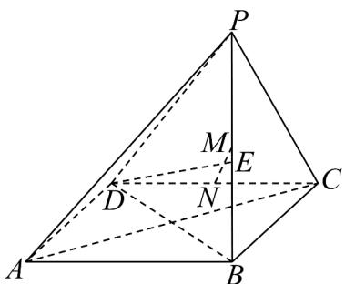

<!-- question-source:start -->
16．（15分）如图，正方形ABCD所在平面外一点P满足PB⊥平面ABCD，且AB=3，PB=4．M为PB

中点， $N$ 为 $DC$ 中点，解答以下问题：

(1)证明：直线 $MN / /$ 平面PAD；

(2)求直线 BD 与平面 PAD 所成角的余弦值；

(3)线段 $BP$ 上是否存在点 $E$ ，使得 $DE \perp$ 平面 $PAC$ ，若存在，求出该点位置，若不存在，则说明理由.
<!-- question-source:end -->

![[高中/课堂同步/题库/人教A版高中数学同步讲义(2026)/04_选择性必修第二册/期末/高二数学上学期期末模拟卷（选择性必修第一册 选择性必修第二册数列，高效培优·提升卷）/三_填空题/questions/answers/Q00081599A1.md]]
