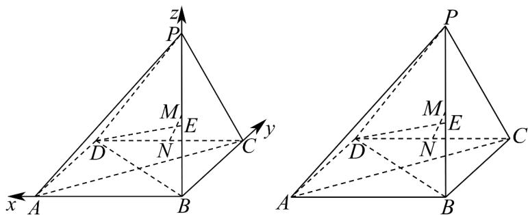

> [!faq]- 《高二数学上学期期末模拟卷（选择性必修第一册 选择性必修第二册数列，高效培优·提升卷）》官方解析
>
> > [!success]- **【答案】** (1)证明见解析(2) $\frac{\sqrt{17}}{5}$ (3)不存在，理由见解析
>
> > [!note]- **【解析】**
> > （1）以 B 为坐标原点，分别以 BC、BA、BP 所在直线为 x、y、z 轴建立如图所示的空间直角
> >
> > 坐标系，
> >
> > 
> >
> > 则 $B(0,0,0)$ ， $C(3,0,0)$ ， $A(0,3,0)$ ， $D(3,3,0)$ ， $P(0,0,4)$ ；
> >
> > $M$ 为 $PB$ 中点，故 $M(0,0,2)$ ； $N$ 为 $DC$ 中点，故 $N\left(3,\frac{3}{2},0\right)$
> >
> > $MN = \left(3, \frac{3}{2}, -2\right)$ $P A = (0, 3, -4)$ , $P D = (3, 3, -4)$
> >
> > 设平面 PAD 的法向量 $n = (x, y, z)$ ，则 $\left\{\begin{aligned}3y - 4z &= 0 \\ 3x + 3y - 4z &= 0\end{aligned}\right.$
> >
> > 令 $z=3$ 得 $\left\{\begin{aligned}x&=0\\ y&=4\\ z&=3\end{aligned}\right.$ ，则 $n=\left(0,4,3\right)$ ，∴ $MN\cdot n=3\times0+\frac{3}{2}\times4+\left(-2\right)\times3=0$ ，
> >
> > 又∵MN∉平面PAD，∴MN//平面PAD.
> >
> > (2) $\because BD = (3, 3, 0)$
> >
> > 由（1）知平面 PAD 的法向量 $n = (0, 4, 3)$
> >
> > 则直线与平面所成角 $\theta$ 的正弦值等于直线方向向量与平面法向量夹角余弦值的绝对值，即：
> >
> > $$
> > \sin \theta = \left| \cos \vec {B D}, \vec {n} \right| = \frac {2 \sqrt {2}}{5}
> > $$
> >
> > $$
> > \cos \theta = \sqrt {1 - (\sin \theta) ^ {2}} = \frac {\sqrt {1 7}}{5}
> > $$
> >
> > (3) 不存在这样的点 $E$ ，理由如下
> >
> > 设 $E(0,0,t)$ （ $0\leq t\leq 4$ ），则 $\overline{DE} = (-3, - 3,t)$
> >
> > 若 $DE \perp$ 平面 PAC ，则 DE 为平面 PAC 的法向量
> >
> > $\because PA=\left(0,3,-4\right)$ ， $PC=\left(3,0,-4\right)$ ，则 $\left\{\begin{aligned}-9-4t&=0\\ -9-4t&=0\end{aligned}\right.$ ，解之得 $t=-\frac{9}{4}$
> >
> > 故不满足 $0 \leq t \leq 4$ ，所以线段 $BP$ 上不存在点 $E$ ，使得 $DE \perp$ 平面 $PAC$
