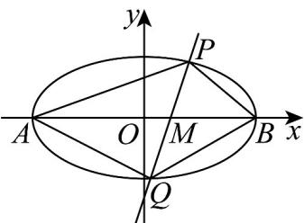

> [!faq]- 《高二数学上学期期末模拟卷（选择性必修第一册 选择性必修第二册数列，高效培优·提升卷）》官方解析
>
> > [!success]- **【答案】** (1) $\frac{x^{2}}{4}+\frac{y^{2}}{3}=1.$ (2)① $\frac{3\sqrt{5}}{4}$ ; ②证明见解析, $\frac{3}{5}$
>
> > [!note]- **【解析】**
> > （1）依题意知： $\left\{\begin{aligned}\frac{c}{a}&=\frac{1}{2}\\b&=\sqrt{3}\\a^{2}&=b^{2}+c^{2}\end{aligned}\right.$ ，解得 $a=2,b=\sqrt{3},c=1$
> >
> > 所以椭圆 C 的方程为： $\frac{x^{2}}{4}+\frac{y^{2}}{3}=1.$
> >
> > (2) ①依题意由 (1) 知 $A(-2,0), B(2,0)$ ，直线 $PQ$ 的斜率不为 0。
> >
> > 设其方程为： $x = my + \frac{1}{2}, P(x_1, y_1), Q(x_2, y_2)$ ，并与椭圆 $C$ 联立方程组：
> >
> > $\left\{ \begin{array}{l} x = my + \frac{1}{2} \\ 3x^{2} + 4y^{2} - 12 = 0 \end{array} \right.$ 得 $(3m^{2} + 4)y^{2} + 3my - \frac{45}{4} = 0$
> >
> > 则 $y_{1} + y_{2} = \frac{-3m}{3m^{2} + 4}, y_{1} \cdot y_{2} = \frac{-45}{4(3m^{2} + 4)}$
> >
> > $S_{1} = \frac{1}{2}\big|AM\big|\cdot \big|y_{1} - y_{2}\big| = \frac{1}{2}\times \frac{5}{2}\times \big|y_{1} - y_{2}\big| = \frac{5}{4}\big|y_{1} - y_{2}\big|$ ，同理： $S_{2} = \frac{3}{4}\big|y_{1} - y_{2}\big|$
> >
> > 所以 $\left|S_{1} - S_{2}\right| = \frac{1}{2}\left|y_{1} - y_{2}\right| = \frac{1}{2}\sqrt{\left(y_{1} + y_{2}\right)^{2} - 4y_{1}\cdot y_{2}} = \frac{1}{2}\cdot \frac{6\sqrt{4m^{2} + 5}}{3m^{2} + 4} = \frac{3\sqrt{4m^{2} + 5}}{3m^{2} + 4}$
> >
> > 令 $t = 4m^{2} + 5$ 5，则 $m^{2} = \frac{t - 5}{4}$ ，
> >
> > 所以 $\left|S_{1}-S_{2}\right|=\frac{3\sqrt{t}}{3\cdot\frac{t-5}{4}+4}=\frac{12\sqrt{t}}{3t+1}=\frac{12}{3\sqrt{t}+\frac{1}{\sqrt{t}}}$
> >
> > 因为 $t = 5$ ，则 $\sqrt{t} = \sqrt{5}$
> >
> > 所以 $y = 3\sqrt{t} + \frac{1}{\sqrt{t}}$ ，结合函数单调性定义知，y 在 $t \in [5, +\infty)$ 时单调递增。
> >
> > 所以 $y=3\sqrt{t}+\frac{1}{\sqrt{t}}\quad\frac{16}{\sqrt{5}}$ ，则 $\left|S_{1}-S_{2}\right|\in\left(0,\frac{3\sqrt{5}}{4}\right]$ .
> >
> > 所以 $\left|S_{1}-S_{2}\right|$ 的最大值是 $\frac{3\sqrt{5}}{4}$ .
> >
> > $k_{1}=\frac{y_{1}}{x_{1}+2}$ ， $k_{2}=\frac{y_{2}}{x_{2}-2}$ ， $my_{1}y_{2}=\frac{15}{4}(y_{1}+y_{2})$ ②证明：由①知
> >
> > 所以 $\frac{k_{1}}{k_{2}}=\frac{y_{1}}{x_{1}+2}\cdot\frac{x_{2}-2}{y_{2}}=\frac{y_{1}\left(my_{2}-\frac{3}{2}\right)}{\left(my_{1}+\frac{5}{2}\right)y_{2}}=\frac{my_{1}y_{2}-\frac{3}{2}y_{1}}{my_{1}y_{2}+\frac{5}{2}y_{2}}$
> >
> > $$
> > = \frac {\frac {1 5}{4} \left(y _ {1} + y _ {2}\right) - \frac {3}{2} y _ {1}}{\frac {1 5}{4} \left(y _ {1} + y _ {2}\right) + \frac {5}{2} y _ {2}} = \frac {\frac {9}{4} y _ {1} + \frac {1 5}{4} y _ {2}}{\frac {1 5}{4} y _ {1} + \frac {2 5}{4} y _ {2}} = \frac {3 \left(\frac {3}{4} y _ {1} + \frac {5}{4} y _ {2}\right)}{5 \left(\frac {3}{4} y _ {1} + \frac {5}{4} y _ {2}\right)} = \frac {3}{5}.
> > $$
> >
> > 
