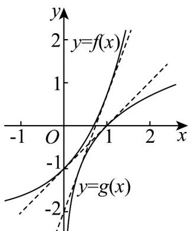

> [!faq]- 《专题01_导数的几何意义有关切线五大常考题型_高效培优专项训练_数学人》官方解析
>
> > [!success]- **【答案】** D
>
> > [!note]- **【分析】**
> > $f(x)=\mathrm{e}^{x}-2,\mathrm{g}(x)=\ln x$ ，只需求出 $f(x)$ 与 $g(x)$ 的公切线斜率，再结合图象分析即可。
>
> > [!note]- **【解析】**
> > 设 $f(x)=\mathrm{e}^{x}-2,\mathrm{g}(x)=\ln x$ 则 $f'(x)=\mathrm{e}^{x},g'(x)=\frac{1}{x}$ 设 $f(x)$ 与 $g(x)$ 的公切线的切点分别为 $(x_{1},\mathrm{e}^{x_{1}}-2),(x_{2},\ln x_{2})$ 则切线方程为 $y-\left(\mathrm{e}^{x_{1}}-2\right)=\mathrm{e}^{x_{1}}(x-x_{1})$ ，即 $y=\mathrm{e}^{x_{1}}x-\mathrm{e}^{x_{1}}x_{1}+\mathrm{e}^{x_{1}}-2$ $y-\ln x_{2}=\frac{1}{x_{2}}(x-x_{2})$ ，即 $y=\frac{1}{x_{2}}x-1+\ln x_{2}$ 所以 $e^{x_{1}}=\frac{1}{x_{2}}①,-e^{x_{1}}x_{1}+e^{x_{1}}-2=-1+\ln x_{2}②$ 由①式可得 $x_{1}=\ln\frac{1}{x_{2}}=-\ln x_{2}$ ，代入②式可得 $-e^{x_{1}}x_{1}+e^{x_{1}}-2=-1-x_{1}$ 即 $(e^{x_{1}}-1)(1-x_{1})=0$ ，解得 $x_{1}=0$ 或 $x_{1}=1$ 所以公切线的斜率为 $^{1}$ 或e
> > 由图可得 $a\in[1,e]$ .
> >
> > 
> >
> > 故选 **D**·
