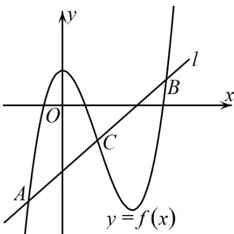

> [!faq]- 《专题01_导数的几何意义有关切线五大常考题型_高效培优专项训练_数学人》官方解析
>
> > [!success]- **【答案】** ABD
>
> > [!note]- **【分析】**
> > A：先分析 $f(x)$ 的单调性，再通过零点的存在性定理判断出零点个数；B：设出切点坐标，根据切点纵坐标等于直线方程中的y值以及切点处导数值等于直线的斜率，由此分析可求出结果；C：设出切点坐标，根据切点与原点连线斜率等于切点处导数值，化简可得方程，构造函数利用导数思想判断方程解的个数，由此可知结果；D：判断出 $f(x)$ 的对称性以及直线所过定点，作出图象，利用对称性求解出交点横坐标之和。
>
> > [!note]- **【解析】**
> > A：因为 $f'(x) = 3x^2 - 2ax + a - 3$ ，记 $\Delta = 4a^2 - 12(a - 3) = 4\left(a - \frac{3}{2}\right)^2 + 27 > 0$ ，所以 $f'(x) = 0$ 有两个不等实根 $x_1, x_2 (x_1 < x_2)$ ，当 $x \in (-\infty, x_1)$ 和 $x \in (x_2, +\infty)$ 时， $f'(x) > 0$ ，当 $x \in (x_1, x_2)$ 时， $f'(x) < 0$ ，所以 $f(x)$ 在 $(-\infty, x_1)$ 和 $(x_2, +\infty)$ 上单调递增，在 $(x_1, x_2)$ 上单调递减；
> >
> > 由三次函数的性质可知，当 $x \to -\infty$ 时， $f(x) < 0$ ，当 $x \to +\infty$ 时， $f(x) > 0$ ，且 $f(0) = 1, f(1) = -1$
> >
> > $$
> > f (x) _ {\text {在}} (- \infty , 0), (0, 1), (1, + \infty)
> > $$
> >
> > 结合 $f(x)$ 的单调性可知， $f(x)$ 总存在三个零点，故 $\mathsf{A}$ 正确；
> >
> > B：设切点为 $\left(m,m^3 -am^2 +\left(a - 3\right)m + 1\right)$
> >
> > 所以 $\left\{ \begin{array}{l} 3m^2 - 2am + a - 3 = -2 \\ 2m + m^3 - am^2 + (a - 3)m + 1 - 1 = 0 \end{array} \right.$ ，化简可得 $\left\{ \begin{array}{l} 3m^2 - 2am + a = 1 \\ m(m - 1)(m - (a - 1)) = 0 \end{array} \right.$ ，
> >
> > 当 $m = 0$ 时，解得 $a = 1$ ；当 $m = 1$ 时，解得 $a = 2$ ；当 $m = a - 1$ ，代入解得 $m = 0, a = 1$
> >
> > 所以存在 $a = 1$ 或2使得 $2x + y - 1 = 0$ 是 $f(x)$ 的切线，故B正确；
> >
> > C：显然 $(0,0)$ 不是切点，设切点 $\left(n,n^3 -an^2 +(a - 3)n + 1\right)$
> >
> > 由题可知 $\frac{n^3 - an^2 + (a - 3)n + 1 - 0}{n - 0} = 3n^2 - 2an + a - 3$ ，化简可得 $2n^3 - an^2 - 1 = 0$ ，
> >
> > 令 $g(n) = 2n^3 - an^2 - 1$ ，则 $g'(n) = 6n^2 - 2an = 6n\left(n - \frac{a}{3}\right)$ ，
> >
> > 当 $a = 0$ 时， $g'(n) = 6n^2 - 0$ ，所以 $g(n)$ 在 $(- \infty, +\infty)$ 上单调递增，
> >
> > 此时 $g(n) = 0$ 至多一个解，即此时至多有一条过 $O$ 点的切线，故 $\mathbb{C}$ 错误；
> >
> > D：当 $a = 3$ 时， $f(x) = x^3 - 3x^2 + 1$ ， $f(2 - x) = (2 - x)^3 - 3(2 - x)^2 + 1 = -x^3 + 3x^2 - 3$
> >
> > 所以 $f(x)+f(2-x)=-2$ ，所以 $f(x)$ 关于点 $(1,-1)$ 成中心对称，
> >
> > 又因为 $(m+2)x+(1-m)y-2m-1=0\Leftrightarrow m(x-y-2)+2x+y-1=0$
> >
> > 令 $\left\{ \begin{array}{l}x - y - 2 = 0\\ 2x + y - 1 = 0 \end{array} \right.$ ，解得 $\left\{ \begin{array}{l}x = 1\\ y = -1 \end{array} \right.$ ，所以直线经过定点 $(1, - 1)$ ，定点即为 $f(x)$ 的对称中心，
> >
> > 因为直线 l 的斜率 $k=\frac{m+2}{m-1}=\frac{m-1+3}{m-1}=1+\frac{3}{m-1}$ ，且 m>1，所以 k>1，
> >
> > 在同一平面直角坐标系中作出 $y = f(x)$ 和直线 $l$ 的图象，如下图所示，
> >
> > 
> >
> > 由图象可知， $l$ 与 $f(x)$ 交于 $A,B,C$ 三点，显然 $A,B$ 关于 $C(1, - 1)$ 对称，
> >
> > 所以 $x_{A} + x_{B} = 2x_{C} = 2$ ，所以 $x_{A} + x_{B} + x_{C} = 3$ ，故 D 正确；
> >
> > 故选 **ABD**.
