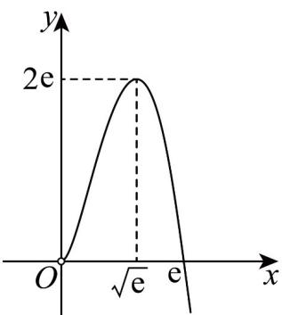

> [!faq]- 《专题01_导数的几何意义有关切线五大常考题型_高效培优专项训练_数学人》官方解析
>
> > [!success]- **【答案】** C
>
> > [!note]- **【分析】**
> > 设直线与 $g(x) = x^2$ 的切点为 $(x_1, x_1^2)$ ，然后根据导数的几何意义可推得切线方程为 $y = 2x_1x - x_1^2$ ，同样可推 $f(x) = a\ln x$ 的切线方程为 $y = \frac{a}{x_2} x + a(\ln x_2 - 1)$ 。两条切线重合，即可得出 $a = 4x_2^2 - 4x_2^2\ln x_2$ 有唯一实根。构造 $h(x) = 4x^2 - 4x^2\ln x (x > 0)$ ，根据导函数得出函数的性质，作出函数的图象，结合图象，即可得出答案。
>
> > [!note]- **【解析】**
> > 设直线与 $g(x) = x^2$ 的切点为 $\left(x_{1},x_{1}^{2}\right)$
> >
> > 因为 $g'(x)=2x$ ，根据导数的几何意义可知该直线的斜率为 $2x_{1}$ ，
> > 即该直线的方程为 $y - x_{1}^{2} = 2x_{1}(x - x_{1})$ 即 $y = 2x_{1}x - x_{1}^{2}$
> >
> > 设直线与 $f(x) = a\ln x$ 的切点为 $\left(x_{2},a\ln x_{2}\right)$
> >
> > 因为 $f'(x) = \frac{a}{x}$ ，根据导数的几何意义可知该直线的斜率为 $\frac{a}{x_2}$ ，
> >
> > 即该直线的方程为 $y - a \ln x_{2} = \frac{a}{x_{2}}(x - x_{2})$ ,
> >
> > 即 $y = \frac{a}{x_2} x + a(\ln x_2 - 1)$
> >
> > 因为函数 $f(x) = a\ln x (a > 0)$ 和 $g(x) = x^2$ 有且只有一条公切线，
> >
> > 所以有 $\left\{\begin{aligned}&2x_{1}=\frac{a}{x_{2}}\\&a\left(\ln x_{2}-1\right)=-x_{1}^{2}\end{aligned}\right.$
> >
> > 即 $a = 4x_{2}^{2} - 4x_{2}^{2}\ln x_{2}$ 有唯一实根.
> >
> > 令 $h(x) = 4x^{2} - 4x^{2}\ln x(x > 0)$
> >
> > 则 $h'(x)=8x-8x\ln x-4x=4x(1-2\ln x)$ .
> >
> > 解 $h'(x)=0$ ，可得 $x=\sqrt{e}$ .
> >
> > 当 $4x(1 - 2\ln x) > 0$ 时， $0 < x < \sqrt{\mathrm{e}}$ ，所以 $h(x)$ 在 $(0, \sqrt{\mathrm{e}})$ 上单调递增；
> >
> > 当 $4x(1 - 2\ln x) < 0$ 时， $x > \sqrt{\mathrm{e}}$ ，所以 $h(x)$ 在 $(\sqrt{\mathrm{e}}, +\infty)$ 上单调递减。
> >
> > 所以 $h(x)$ 在 $x = \sqrt{e}$ 处取得最大值 $h(\sqrt{e}) = 4e - 4e \times \frac{1}{2} = 2e$ .
> >
> > 当 $x \to 0$ 时， $h(x) \to 0, h(\mathrm{e}) = 4\mathrm{e}^2 - 4\mathrm{e}^2 \ln \mathrm{e} = 0$ ，函数 $h(x)$ 图象如图所示，
> >
> > 
> >
> > 因为 $a > 0, a = 4x^{2} - 4x^{2}\ln x$ 有唯一实根，所以只有 $a = 2\mathrm{e}$
> >
> > 故选 **C**
