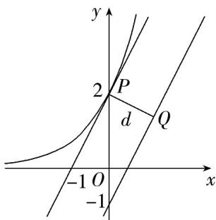

> [!faq]- 《专题01_导数的几何意义有关切线五大常考题型_高效培优专项训练_数学人》官方解析
>
> > [!success]- **【答案】** $\frac{3\sqrt{5}}{5}$
>
> > [!note]- **【分析】**
> > 设 $2x - y = t(t > 0), f(t) = \mathrm{e}^{t - 1} - \ln t - 1,$ 利用导数研究函数的单调性，得出当 $t = 1$ 时，函数最小值为 $0\cdot$ 从而可得点 $P$ 在直线 $2x - y - 1 = 0$ 上运动·，设与 $2x - y - 1 = 0$ 平行的直线与 $y = 2\mathrm{e}^x$ 相切于点 $Q(x_0,2\mathrm{e}^{x_0})$ 利用求导求得切点，结合图形计算出点到直线的距离即可·
>
> > [!note]- **【解析】**
> > 设 $2x - y = t(t > 0),\mathrm{e}^{2x - y - 1} - \ln (2x - y)\leq 1\Leftrightarrow \mathrm{e}^{t - 1} - \ln t - 1\leq 0$
> >
> > 设 $f(t)=\mathrm{e}^{t-1}-\ln t-1, f'(t)=\mathrm{e}^{t-1}-\frac{1}{t}$
> >
> > 当 $t \in (0,1)$ 时， $f'(t) < 0, f(t)$ 单调递减，
> >
> > 当 $t\in(1,+\infty)$ 时， $f'(t)>0,f(t)$ 单调递增，
> >
> > 所以 $f(t)_{\min}=f(1)=0$ ， $e^{t-1}-\ln t-1$ 0
> >
> > 所以 $e^{t-1}-\ln t-1=0\Leftrightarrow t=2x-y=1$ ，即点 P 在直线 2x-y-1=0 上运动.
> >
> > 设与 $2x - y - 1 = 0$ 平行的直线与 $y = 2\mathrm{e}^{x}$ 相切于点 $Q(x_0,2\mathrm{e}^{x_0})$ ，令 $y^{\prime}|_{x = x_0} = 2\mathrm{e}^{x_0} = 2$
> >
> > 得 $x_0 = 0$ ，故切点为 $Q(0,2)$ ，由图知其到直线 $2x - y - 1 = 0$ 的距离 $d = \frac{3\sqrt{5}}{5}$ ，即为 $|PQ|$ 的最小值·
> >
> > 
> >
> > 故答案为： $\frac{3\sqrt{5}}{5}$
