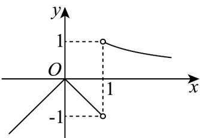

> [!faq]- 《专题02_利用导数研究函数的单调性六大常考题型_高效培优专项训练_数学》官方解析
>
> > [!success]- **【答案】** D
>
> > [!note]- **【分析】**
> > 根据方程 $f(x)-a(x-1)=0$ 恰有两个解，得出 与 $g(x)=\left\{\begin{aligned}\frac{\ln x}{x-1},&x>1\\ -|x|,&x<1\end{aligned}\right.$ 有一个交点，结合图象可得参数范围．
>
> > [!note]- **【解析】**
> > 因为方程 $f(x) - a(x - 1) = 0$ 恰有两个解，又因为 $f(1) - a(1 - 1) = f(1) = 0$
> >
> > 则 $x = 1$ 为方程 $f(x) - a(x - 1) = 0$ 的一个解，
> >
> > 当 $x \neq 1$ 时，由 $f(x) - a(x - 1) = 0$
> >
> > 则 $a = \frac{f(x)}{x - 1} = \begin{cases} \frac{\ln x}{x - 1}, & x > 1 \\ \frac{|x^2 - x|}{x - 1}, & x < 1 \end{cases} = \begin{cases} \frac{\ln x}{x - 1}, & x > 1 \\ -|x|, & x < 1 \end{cases}$ 有一个解，
> >
> > 所以 $y = a$ 与 $g(x) = \begin{cases} \frac{\ln x}{x - 1}, & x > 1 \\ -|x|, & x < 1 \end{cases}$ 有一个交点，
> >
> > 当 $\int_{x>1}$ 时， $g(x)=\frac{\ln x}{x-1}, g'(x)=\frac{\frac{x-1}{x}-\ln x}{(x-1)^{2}}=\frac{1-\frac{1}{x}-\ln x}{(x-1)^{2}}$
> >
> > 设 $t(x)=1-\frac{1}{x}-\ln x$ ，x>1 ，
> >
> > 则 $t^{\prime}(x) = \frac{1}{x^{2}} -\frac{1}{x} = \frac{1 - x}{x^{2}} < 0$ ，即 $t(x)$ 在 $(1, + \infty)$ 上单调递减，
> >
> > 所以 $t(x) < t(1) = 0$ ，
> >
> > 所以 $g'(x)=\frac{1-\frac{1}{x}-\ln x}{(x-1)^{2}}<0$ ，则 $g(x)$ 在 $(1,+\infty)$ 上单调递减，
> >
> > 当 $x \to 1, g(x) \to 1$ ，且 $x > 1$ 时， $g(x) > 0$
> >
> > 做出函数 $g(x)$ 的图象，如下：
> >
> > 
> >
> > 结合图象可得，要使 $y = a$ 与 $g(x) = \begin{cases} \frac{\ln x}{x - 1}, & x > 1 \\ -|x|, & x < 1 \end{cases}$ 有一个交点，
> >
> > 则 $a \leq -1$ 或 $0 \leq a < 1$
> >
> > 故选 **D**.
