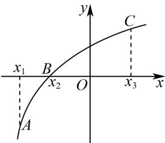

<!-- question-source:start -->
41. 设函数 $y = f(x)$ 在 $\mathbf{R}$ 上处处存在导数，其导函数为 $y = f'(x)$ . 已知点 $A(x_1, y_1)$ 、 $B(x_2, y_2)$ 、 $C(x_3, y_3)$ ，在曲线 $y = f(x)$ 上如图，则在下列选项中正确的是（）

A. $f'(x_{1}) < f'(x_{2}) < f'(x_{3});$

B．函数 $y = f(x)$ 在 $x = x_{2}$ 处附近的平均变化率均小于 $f'(x_{2})$ ;

C．点 $x = x_{2}$ 是函数 $y = f(x)$ 的一个极值点；

D．函数 $y=f(x)$ 在区间 $\left[x_{1},x_{3}\right]$ 上不存在驻点.
<!-- question-source:end -->

![[高中/课堂同步/题库/人教A版高中数学同步讲义(2026)/04_选择性必修第二册/第五章一元函数的导数及其应用/专项训练/专题02_利用导数研究函数的单调性六大常考题型_高效培优专项训练_数学/题型五_sec_05/questions/answers/Q00061237A1.md]]
