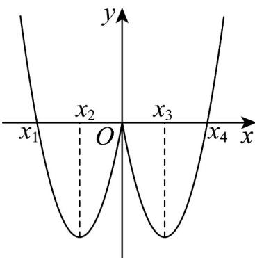

<!-- question-source:start -->
44. 已知函数 $f(x)$ 的导函数为 $f'(x)$ ，若函数 $f'(x)$ 的图象如图所示，则 $f(x)$ 的极小值点为（）

A. $x_{1}$ B.0 C. $x_{2}$ 或 $x_{3}$ D. $x_{4}$
<!-- question-source:end -->

![[高中/课堂同步/题库/人教A版高中数学同步讲义(2026)/04_选择性必修第二册/第五章一元函数的导数及其应用/专项训练/专题02_利用导数研究函数的单调性六大常考题型_高效培优专项训练_数学/题型五_sec_05/questions/answers/Q00061239A1.md]]
