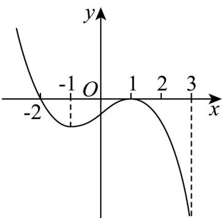

<!-- question-source:start -->
48. 已知函数 $f(x)$ 的导函数 $f'(x)$ 的图象如图所示，则函数 $f(x)$ 的极值点的个数有 \_\_\_\_ 个

<!-- question-source:end -->

![[高中/课堂同步/题库/人教A版高中数学同步讲义(2026)/04_选择性必修第二册/第五章一元函数的导数及其应用/专项训练/专题02_利用导数研究函数的单调性六大常考题型_高效培优专项训练_数学/题型五_sec_05/questions/answers/Q00061241A1.md]]
