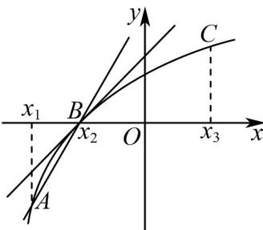

> [!faq]- 《专题02_利用导数研究函数的单调性六大常考题型_高效培优专项训练_数学》官方解析
>
> > [!success]- **【答案】** D
>
> > [!note]- **【分析】**
> > 根据导数的几何意义、极值点的定义、驻点的定义逐一判断即可.
>
> > [!note]- **【解析】**
> > A：根据导数几何意义可知： $f'(x_{1}) > f'(x_{2}) > f'(x_{3})$ ，因此本选项说法不正确；
> >
> > B：由函数 $y = f(x)$ 的图象可知： $k_{AB} > f'(x_2)$ ，因此本选项说法不正确；
> >
> > 
> >
> > C：点 $(x_{2},0)$ 左右两侧的单调性都是单调递增，所以点 $x = x_{2}$ 不是函数 $y = f(x)$ 的极值点，
> >
> > 因此本选项说法不正确；
> >
> > D：由图象可知函数 $y = f(x)$ 在区间 $[x_1, x_3]$ 上不存在导函数为零的点，所以不存在驻点，因此本选项说法正确，.
> >
> > 故选 **D**
