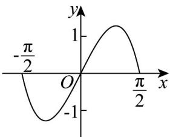

> [!faq]- 《专题02_利用导数研究函数的单调性六大常考题型_高效培优专项训练_数学》官方解析
>
> > [!success]- **【答案】** BC
>
> > [!note]- **【分析】**
> > 结合 $f'(x)$ 的图象，先分析 $f'(x)$ 的符号与原函数 $f(x)$ 的单调性的关系判断单调性，再利用单调性判断出极值点.
>
> > [!note]- **【解析】**
> > 由图可知，当 $x \in (-\infty, c)$ 时， $f'(x) \leq 0$ ，当 $x \in (c, +\infty)$ 时， $f'(x) > 0$
> >
> > 所以 $c$ 是 $f(x)$ 的极小值点， $f(x)$ 无极大值点， $f(x)$ 在 $(- \infty, c)$ 上单调递减，在 $(c, +\infty)$ 上单调递增。
> >
> > 故答案为：BC.
> >
> > 43. 函数 $f(x) = \frac{\left(\mathrm{e}^{2x} - 1\right)\cos x}{\mathrm{e}^x}\left(-\frac{\pi}{2} \leq x \leq \frac{\pi}{2}\right)$ 的图象大致为（）
> >
> > A
> >
> > 
> >
> > B
> >
> > 
> >
> > C
> >
> > 
> >
> > D
> >
> > 
> >
> > 【答案】B
> >
> > 【分析】由 $f(x)$ 的奇偶性和 $0 \leq x \leq \frac{\pi}{2}$ 时， $f(x) = 0$ ， $f'(\frac{\pi}{4}) = \sqrt{2} e^{-\frac{\pi}{4}} > 0$ 排除选项求解.
> >
> > 【详解】因为 $f(x) = \left(\mathrm{e}^x -\mathrm{e}^{-x}\right)\cos x$ ，且 $f(-x) = \left(\mathrm{e}^{-x} - \mathrm{e}^x\right)\cos x = -f(x)$ ，则 $f(x)$ 是奇函数，排除选项A；当 $0\leq x\leq \frac{\pi}{2}$ 时， $f(x) = 0$ ，故排除选项C；又 $f'(x) = \left(\mathrm{e}^x +\mathrm{e}^{-x}\right)\cos x - \left(\mathrm{e}^x -\mathrm{e}^{-x}\right)\sin x$ ， $f'\left(\frac{\pi}{4}\right) = \sqrt{2}\mathrm{e}^{-\frac{\pi}{4}} >0$ ，故排除选项D，
> >
> > 故选 **B**
