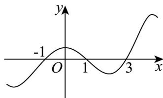

<!-- question-source:start -->
2．已知函数 $f(x)$ 的定义域为 R，其导函数为 $f'(x), f'(x)$ 的部分图象如图所示，则以下说法不正确的是（）

A. $f(x)$ 在 $(3, +\infty)$ 上单调递增
B. $f(x)$ 的最大值为 $f(1)$ C. $f(x)$ 的一个极大值点为-1
D. $f(x)$ 的一个减区间为 $(1,3)$
<!-- question-source:end -->

![[高中/课堂同步/题库/人教A版高中数学同步讲义(2026)/04_选择性必修第二册/第五章一元函数的导数及其应用/专项训练/专题03_利用导数研究函数最值五大常考题型_高效培优专项训练_数学人教/题型一_sec_02/questions/answers/Q00061254A1.md]]
