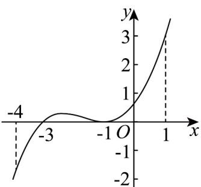

<!-- question-source:start -->
3. 已知定义在 $\mathbf{R}$ 上的函数 $f(x)$ 的导函数 $f'(x)$ 的图象如图所示，下列命题中正确的是（）

A. -1是 $f(x)$ 的极值点
B. $f(x)$ 在区间 $(-∞,-3)$ 上单调递增
C. -3是 $f(x)$ 在区间 $[-4,1]$ 上的最小值点
D. 曲线 $y=f(x)$ 在点 $(0,f(0))$ 处的切线斜率小于零
<!-- question-source:end -->

![[高中/课堂同步/题库/人教A版高中数学同步讲义(2026)/04_选择性必修第二册/第五章一元函数的导数及其应用/专项训练/专题03_利用导数研究函数最值五大常考题型_高效培优专项训练_数学人教/题型一_sec_02/questions/answers/Q00061255A1.md]]
