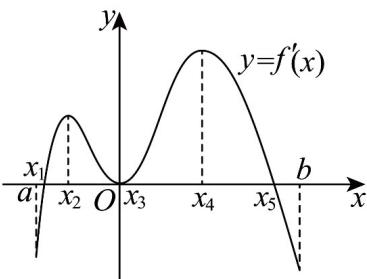

<!-- question-source:start -->
5. $f(x)$ 是定义在区间 $[a, b]$ 上的函数，其导函数 $f'(x)$ 的图象如图所示，则在区间 $[a, b]$ 内（）

A. 函数 $f(x)$ 有三个极值点 B. 函数 $f(x)$ 的单调增区间为 $(x_1, x_5)$ C. 函数 $f(x)$ 的最大值可能为 $f(x_5)$ D. 函数 $f(x)$ 的最小值可能为 $f(a)$
<!-- question-source:end -->

![[高中/课堂同步/题库/人教A版高中数学同步讲义(2026)/04_选择性必修第二册/第五章一元函数的导数及其应用/专项训练/专题03_利用导数研究函数最值五大常考题型_高效培优专项训练_数学人教/题型一_sec_02/questions/answers/Q00061256A1.md]]
