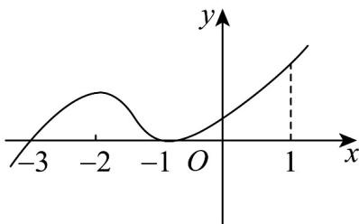

<!-- question-source:start -->
10．已知函数 $y = f(x)$ 为连续可导函数， $y = (x + 1)f'(x)$ 的图象如图所示，以下命题正确的是（）

A. $f(-1)$ 是函数的最小值
B. $f(-3)$ 是函数的极小值
C. $y = f(x)$ 在区间 $(-3, 1)$ 上单调递增
D. $y = f(x)$ 在 $x = 0$ 处的切线的斜率大于0
<!-- question-source:end -->

![[高中/课堂同步/题库/人教A版高中数学同步讲义(2026)/04_选择性必修第二册/第五章一元函数的导数及其应用/专项训练/专题03_利用导数研究函数最值五大常考题型_高效培优专项训练_数学人教/题型一_sec_02/questions/answers/Q00061260A1.md]]
