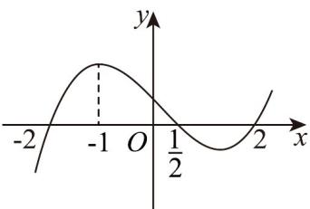

> [!faq]- 《专题03_利用导数研究函数最值五大常考题型_高效培优专项训练_数学人教》官方解析
>
> > [!success]- **【答案】** C
>
> > [!note]- **【分析】**
> > 根据导函数的正负，可确定 $f(x)$ 的单调性，即可结合极值和选项逐一求解.
>
> > [!note]- **【解析】**
> > 由 $f'(x)$ 的图象可知：当x<-3时， $f'(x)<0$ ，当x-3时， $f'(x)=0$ ，
> > 故 $f(x)$ 在 $(-∞,-3)$ 单调递减，在 $(-3,+∞)$ 单调递增，
> > 故x=-3是函数 $f(x)$ 的极小值点，也是 $[-4,1]$ 上的最小值点，故A错误，B错误，C正确，
> > 由图可知： $f'(0)>0$ ，因此曲线 $y=f(x)$ 在点 $(0,f(0))$ 处的切线斜率大于零，故D错误，
> > 故选：C
> >
> > 4. 函数 $f(x)$ 的导函数 $f'(x)$ 的图象如图所示，则下列说法正确的有（）
> >
> > 
> >
> > A. $x = -2$ 为函数 $f(x)$ 的一个零点
> >
> > B．函数 $f(x)$ 在区间 $\left(-1, \frac{1}{2}\right)$ 上单调递减
> >
> > C. $x = \frac{1}{2}$ 为函数 $f(x)$ 的一个极大值点
> >
> > D. $f(-1)$ 是函数 $f(x)$ 的最大值
> >
> > 【答案】C
> >
> > 【分析】利用导数图象，分析函数 $f(x)$ 的单调性，逐项判断即可.
> >
> > 【详解】对于 A 选项，由图象可知，当 x < -2 时， $f'(x) < 0$ ，当 $-2 < x < \frac{1}{2}$ 时， $f'(x) > 0$ ，
> >
> > 所以，函数 $f(x)$ 在区间 $(- \infty, -2)$ 上单调递减，在区间 $\left(-2, \frac{1}{2}\right)$ 上单调递增，
> >
> > 所以 x = -2 为函数 $f(x)$ 的一个极小值点，不一定为函数 $f(x)$ 的一个零点，A 错；
> >
> > 对于B选项，当 $-1 < x < \frac{1}{2}$ 时， $f'(x) > 0$ ，则函数 $f(x)$ 在区间 $\left(-1, \frac{1}{2}\right)$ 上单调递增，B错；
> >
> > 对于 C 选项，当 $-2 < x < \frac{1}{2}$ 时， $f'(x) > 0$ ，当 $\frac{1}{2} < x < 2$ 时， $f'(x) < 0$ ，
> >
> > 所以，函数 $f(x)$ 在区间 $\left(-2, \frac{1}{2}\right)$ 上单调递增，在区间 $\left(\frac{1}{2}, 2\right)$ 上单调递减，
> >
> > 所以， $x = \frac{1}{2}$ 为函数 $f(x)$ 的一个极大值点，C对；
> >
> > 对于 D 选项，因为函数 $f(x)$ 在区间 $\left(-2, \frac{1}{2}\right)$ 上单调递增，故 $f(-1)$ 不是函数 $f(x)$ 的最大值，D 错.
> >
> > 故选 **C**.
