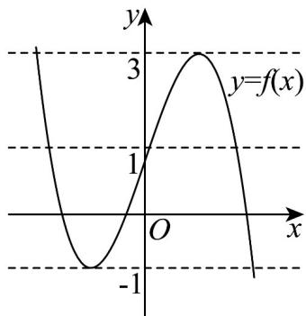

> [!faq]- 《专题03_利用导数研究函数最值五大常考题型_高效培优专项训练_数学人教》官方解析
>
> > [!success]- **【答案】** (1) $\left[-1,3\right]$ (2)答案见解析
>
> > [!note]- **【分析】**
> > （1）利用导数的性质进行求解即可；
> >
> > (2) 根据 (1) 的结论，画出函数的图象、函数零点的定义，利用数形结合思想进行求解即可.
>
> > [!note]- **【解析】**
> > （1）由 $f(x) = -x^3 + 3x + 1 \Rightarrow f'(x) = -3x^2 + 3 = -3(x + 1)(x - 1)$ ，
> >
> > 令 $f'(x)=0 \Rightarrow x=-1$ ，或1，
> >
> > 当 $x \in [-2, -1)$ 时， $f'(x) < 0, f(x)$ 单调递减，
> >
> > 当 $x \in (-1, 1)$ 时， $f'(x) > 0, f(x)$ 单调递增，
> >
> > 当 $x \in (1,2]$ 时， $f'(x) < 0, f(x)$ 单调递减，
> >
> > 所以函数 $f(x)$ 在 $x \in [-2, 2]$ 时，极小值为 $f(-1) = -1$ ，极大值为 $f(1) = 3$ ，
> >
> > 而 $f(2) = -1, f(-2) = 3$
> >
> > 所以函数 $f(x)$ 在 $x \in [-2, 2]$ 时，最大值为3，最小值为-1，
> >
> > 所以函数 $f(x)$ 在 $x \in [-2, 2]$ 时，值域为 $[-1, 3]$
> >
> > (2) 函数 $g(x)=f(x)-a=0 \Rightarrow a=f(x)$ ,
> >
> > 函数 $g(x) = f(x) - a$ 的零点个数转化为直线 $y = a$ 与函数 $f(x)$ 图象交点个数问题，
> >
> > 结合（1）的结论，在同一直角坐标系内，画出直线 $y = a$ 与函数 $f(x)$ 图象，
> >
> > 当 $a > 3$ ，或 $a < -1$ 时，直线 $y = a$ 与函数 $f(x)$ 图象没有交点，因此函数 $g(x)$ 没有零点，
> >
> > 当 $a = 3$ ，或 $a = -1$ 时，直线 $y = a$ 与函数 $f(x)$ 图象有2个交点，因此函数 $g(x)$ 有2个零点，
> >
> > 当 $-1 < a < 3$ 时，直线 $y = a$ 与函数 $f(x)$ 图象有3个交点，因此函数 $g(x)$ 有3个零点，
> >
> > 综上所述：当 $a > 3$ ，或 $a < -1$ 时，函数 $g(x)$ 没有零点，
> >
> > 当 $a = 3$ ，或 $a = -1$ 时，函数 $g(x)$ 有2个零点，
> >
> > 当 $-1 < a < 3$ 时，函数 $g(x)$ 有3个零点.
> >
> > 
