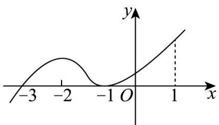

## 题型一：函数最值与极值的关系

1. 函数 $y = f(x)$ 的导函数 $y = f'(x)$ 的图像如图所示，以下命题正确的是（）

A. $f(-1)$ 是函数的最小值

B. $f(-3)$ 是函数的极值

C. $y = f(x)$ 在区间 $(-3,1)$ 上单调递增

D. $y = f(x)$ 在 $x = 0$ 处的切线的斜率大于0

【答案】BCD

【分析】利用导函数的图像，可得函数 $f(x)$ 的单调性，逐一判断即可.

【详解】由图像可知：当 x < -3 时， $f'(x) < 0$ ，当 x > -3 时， $f'(x) = 0$ ，

所以函数 $f(x)$ 在 $(- \infty, -3)$ 上单调递减，在 $(-3, +\infty)$ 单调递增，

所以 $f(-3)$ 是函数的极小值， $y = f(x)$ 在区间 $(-3,1)$ 上单调递增，故A错误，B正确，C正确；由图可知 $f'(0) > 0$ ，故D正确，

故选：BCD.

![[高中/课堂同步/题库/人教A版高中数学同步讲义(2026)/04_选择性必修第二册/第五章一元函数的导数及其应用/专项训练/专题03_利用导数研究函数最值五大常考题型_高效培优专项训练_数学人教/题型一_sec_02/questions/Q00061254.md]]
![[高中/课堂同步/题库/人教A版高中数学同步讲义(2026)/04_选择性必修第二册/第五章一元函数的导数及其应用/专项训练/专题03_利用导数研究函数最值五大常考题型_高效培优专项训练_数学人教/题型一_sec_02/questions/Q00061255.md]]
![[高中/课堂同步/题库/人教A版高中数学同步讲义(2026)/04_选择性必修第二册/第五章一元函数的导数及其应用/专项训练/专题03_利用导数研究函数最值五大常考题型_高效培优专项训练_数学人教/题型一_sec_02/questions/Q00061256.md]]
![[高中/课堂同步/题库/人教A版高中数学同步讲义(2026)/04_选择性必修第二册/第五章一元函数的导数及其应用/专项训练/专题03_利用导数研究函数最值五大常考题型_高效培优专项训练_数学人教/题型一_sec_02/questions/Q00061257.md]]
![[高中/课堂同步/题库/人教A版高中数学同步讲义(2026)/04_选择性必修第二册/第五章一元函数的导数及其应用/专项训练/专题03_利用导数研究函数最值五大常考题型_高效培优专项训练_数学人教/题型一_sec_02/questions/Q00061258.md]]
![[高中/课堂同步/题库/人教A版高中数学同步讲义(2026)/04_选择性必修第二册/第五章一元函数的导数及其应用/专项训练/专题03_利用导数研究函数最值五大常考题型_高效培优专项训练_数学人教/题型一_sec_02/questions/Q00061259.md]]
![[高中/课堂同步/题库/人教A版高中数学同步讲义(2026)/04_选择性必修第二册/第五章一元函数的导数及其应用/专项训练/专题03_利用导数研究函数最值五大常考题型_高效培优专项训练_数学人教/题型一_sec_02/questions/Q00061260.md]]
![[高中/课堂同步/题库/人教A版高中数学同步讲义(2026)/04_选择性必修第二册/第五章一元函数的导数及其应用/专项训练/专题03_利用导数研究函数最值五大常考题型_高效培优专项训练_数学人教/题型一_sec_02/questions/Q00061261.md]]
![[高中/课堂同步/题库/人教A版高中数学同步讲义(2026)/04_选择性必修第二册/第五章一元函数的导数及其应用/专项训练/专题03_利用导数研究函数最值五大常考题型_高效培优专项训练_数学人教/题型一_sec_02/questions/Q00061262.md]]
![[高中/课堂同步/题库/人教A版高中数学同步讲义(2026)/04_选择性必修第二册/第五章一元函数的导数及其应用/专项训练/专题03_利用导数研究函数最值五大常考题型_高效培优专项训练_数学人教/题型一_sec_02/questions/Q00061263.md]]
![[高中/课堂同步/题库/人教A版高中数学同步讲义(2026)/04_选择性必修第二册/第五章一元函数的导数及其应用/专项训练/专题03_利用导数研究函数最值五大常考题型_高效培优专项训练_数学人教/题型一_sec_02/questions/Q00061264.md]]
![[高中/课堂同步/题库/人教A版高中数学同步讲义(2026)/04_选择性必修第二册/第五章一元函数的导数及其应用/专项训练/专题03_利用导数研究函数最值五大常考题型_高效培优专项训练_数学人教/题型一_sec_02/questions/Q00061265.md]]
![[高中/课堂同步/题库/人教A版高中数学同步讲义(2026)/04_选择性必修第二册/第五章一元函数的导数及其应用/专项训练/专题03_利用导数研究函数最值五大常考题型_高效培优专项训练_数学人教/题型一_sec_02/questions/Q00061266.md]]
