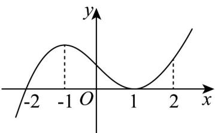

<!-- question-source:start -->
25. 如图是函数 $y = f(x)$ 的导函数 $y = f'(x)$ 的图象，则以下说法正确的为（）

A．-2是函数 $y=f(x)$ 的极小值点

B．函数 $y = f(x)$ 在 x = 1 处取最小值

C．函数 $y = f(x)$ 在 x = 0 处切线的斜率小于零

D．函数 $y=f(x)$ 在区间 $(-2,2)$ 上单调递增
<!-- question-source:end -->

![[高中/课堂同步/题库/人教A版高中数学同步讲义(2026)/04_选择性必修第二册/第五章一元函数的导数及其应用/专项训练/专题03_利用导数研究函数最值五大常考题型_高效培优专项训练_数学人教/题型三_sec_03/questions/answers/Q00061271A1.md]]
