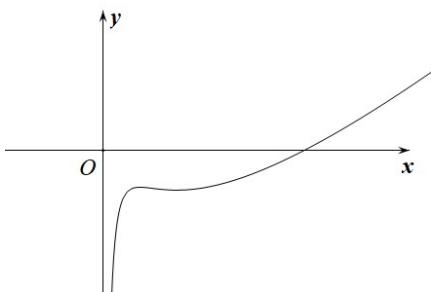

> [!faq]- 《专题04_导数的高级应用七大常考题型_高效培优专项训练_数学人教A版2》官方解析
>
> > [!success]- **【答案】** (1) $\left(-\infty,-3\ln\frac{2}{3}-3\right]$ $$ (2) (- 1, + \infty) \cup \left[ - \frac {5 1 1}{1 6} + 3 \ln 1 6, 1 - 3 \ln 2\right) $$ (3)证明过程见解析
>
> > [!note]- **【分析】**
> > （1）利用导数的性质判断函数的单调性，利用函数的单调性进行求解函数的值域即可；
> >
> > (2) 根据函数零点定义，利用常变量分离法，通过构造新函数，利用导数的性质进行求解即可；
> >
> > (3) 根据函数零点定义，结合基本不等式，通过构造新函数，利用导数的性质进行求解证明即可·
>
> > [!note]- **【解析】**
> > （1）由 $f(a) = a - 3\ln a - \frac{2}{a} - a = -3\ln a - \frac{2}{a} \Rightarrow f'(a) = -\frac{3}{a} + \frac{2}{a^2} = \frac{2 - 3a}{a^2}$ ，
> >
> > 当 $0 < a < \frac{2}{3}$ 时， $f'(a) > 0$ ，函数 $f(a)$ 在 $\left(0, \frac{2}{3}\right)$ 上单调递增，
> >
> > 当 $a > \frac{2}{3}$ 时， $f'(a) < 0$ ，函数 $f(a)$ 在 $\left(\frac{2}{3}, +\infty\right)$ 上单调递减，故 $f(a)_{\max} = f\left(\frac{2}{3}\right) = -3\ln \frac{2}{3} - 3$
> >
> > 当 $a \to +\infty$ 时， $f(a) \to -\infty$ ，故当 $a > 0$ 时，函数 $f(a)$ 的值域为 $\left(-\infty, -3 \ln \frac{2}{3} - 3\right]$
> >
> > (2) 令 $f(x) = x - 3\ln x - \frac{2}{x} - a = 0 \Rightarrow a = x - 3\ln x - \frac{2}{x}$ ，
> >
> > $$
> > g (x) = x - 3 \ln x - \frac {2}{x} \Rightarrow g ^ {\prime} (x) = 1 - \frac {3}{x} + \frac {2}{x ^ {2}} = \frac {x ^ {2} - 3 x + 2}{x ^ {2}} = \frac {(x - 1) (x - 2)}{x ^ {2}}
> > $$
> >
> > 当 $x > 2$ 时， $g'(x) > 0$ ，则 $g(x)$ 在 $(2, +\infty)$ 上单调递增，
> >
> > 当 $1 < x < 2$ 时， $g'(x) < 0$ ，则 $g(x)$ 在 $(1,2)$ 上单调递减，
> >
> > 当 $\frac{1}{16} \leq x < 1$ 时， $g'(x) > 0$ ，则 $g(x)$ 在 $\left[\frac{1}{16}, 1\right)$ 上单调递增，
> >
> > 且当 $x \to +\infty$ 时， $g(x) \to +\infty$ ，作出函数 $g(x)$ 的图象如图所示：
> >
> > 
> >
> > 又 $g(1) = -1, g(2) = 1 - 3 \ln 2, g\left(\frac{1}{16}\right) = -\frac{511}{16} + 3 \ln 16$
> >
> > 要使 $f(x)$ 在 $\left[\frac{1}{16}, +\infty\right)$ 上只有一个零点，需使 $a > -1$ 或 $-\frac{511}{16} + 3\ln 16 \leq a < 1 - 3\ln 2$
> >
> > 即实数 $a$ 的取值范围为； $\left(-1, + \infty\right) \cup \left[-\frac{511}{16} + 3\ln 16, 1 - 3\ln 2\right)$ .
> >
> > (3) 因为 $x_{1}, x_{2}$ 是 $f(x)$ 的两个零点，
> >
> > 所以 $x_{1} - 3\ln x_{1} - \frac{2}{x_{1}} - a = 0$ ， $x_{2} - 3\ln x_{2} - \frac{2}{x_{2}} - a = 0$
> >
> > 两式相加，可得 $x_{1} + x_{2} - 3\left(\ln x_{1} + \ln x_{2}\right) - \left(\frac{2}{x_{1}} +\frac{2}{x_{2}}\right) = 2a$
> >
> > 则有 $x_{1} + x_{2} - 3\ln \left(x_{1}x_{2}\right) - \left(\frac{2}{x_{1}} +\frac{2}{x_{2}}\right) = 2a$ ，即 $x_{1} + x_{2} = 2a + 3\ln \left(x_{1}x_{2}\right) + \frac{2\left(x_{1} + x_{2}\right)}{x_{1}x_{2}}$
> >
> > 因为 $x_{1}, x_{2} > 0$ 且 $x_{1} \neq x_{2}$ ，所以有 $x_{1} + x_{2} > 2\sqrt{x_{1}x_{2}}$ ，
> >
> > 于是有 $x_{1} + x_{2} = 2a + 3\ln \left(x_{1}x_{2}\right) + \frac{2\left(x_{1} + x_{2}\right)}{x_{1}x_{2}} > 2a + 3\ln \left(x_{1}x_{2}\right) + \frac{4\sqrt{x_{1}x_{2}}}{x_{1}x_{2}}$
> >
> > 即 $x_{1} + x_{2} > 2a + 3\ln \left(x_{1}x_{2}\right) + \frac{4}{\sqrt{x_{1}x_{2}}}$ （\*），记 $\sqrt{x_1x_2} = t(t > 0)$
> >
> > 设 $h(t)=2a+6\ln t+\frac{4}{t}$ ，则 $h'(t)=\frac{6}{t}-\frac{4}{t^{2}}=\frac{2(3t-2)}{t^{2}}$ ，
> >
> > 当 $t > \frac{2}{3}$ 时， $h'(t) > 0$ ，则 $h(t)$ 在 $\left(\frac{2}{3}, +\infty\right)$ 上单调递增，
> >
> > 当 $0 < t < \frac{2}{3}$ 时， $h'(t) < 0$ ，则 $h(t)$ 在 $\left(0, \frac{2}{3}\right)$ 上单调递减，
> >
> > $h(t)_{\min}=h\left(\frac{2}{3}\right)=2a+6\ln2-6\ln3+6$ ，即 $h(t)\quad2a+6\ln2-6\ln3+6$ ，
> >
> > 故由（ $^{*}$ ）可得 $x_{1} + x_{2} > 2a + 3\ln \left(x_{1}x_{2}\right) + \frac{4}{\sqrt{x_{1}x_{2}}} - 2a + 6\ln 2 - 6\ln 3 + 6$
> >
> > 即 $x_{1} + x_{2} + 6\ln 3 > 2a + 6 + 6\ln 2$
