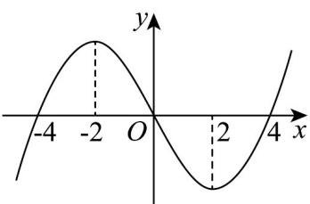

<!-- question-source:start -->
30. 已知函数 $f(x)$ 的导函数的图象如图所示，则下列关于 $f(x)$ 的说法正确的是（）

A. 在区间 $[-2, 2]$ 上是减函数 B. 2 是极小值点

C. 在 $\mathbf{R}$ 上一定没有最大值 D. $f(x) = 0$ 最多有四个根
<!-- question-source:end -->

![[高中/课堂同步/题库/人教A版高中数学同步讲义(2026)/04_选择性必修第二册/第五章一元函数的导数及其应用/专项训练/专题04_导数的高级应用七大常考题型_高效培优专项训练_数学人教A版2/题型五_sec_06/questions/answers/Q00061323A1.md]]
