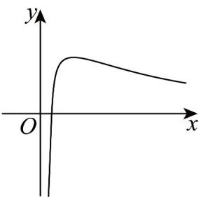

> [!faq]- 《专题04_导数的高级应用七大常考题型_高效培优专项训练_数学人教A版2》官方解析
>
> > [!success]- **【答案】** $k=\frac{1}{e}$ 或 $k\leq0$ ，
>
> > [!note]- **【分析】**
> > 分离参数，构造函数 $f(x) = \frac{\ln x}{x}$ ，求导得函数的单调性，即可作出函数图象，结合函数图象即可求解：
>
> > [!note]- **【解析】**
> > 由 $\ln x - kx = 0$ 可得 $k = \frac{\ln x}{x} (x > 0)$
> >
> > 记 $f(x)=\frac{\ln x}{x}(x>0)$ ，则 $f'(x)=\frac{1-\ln x}{x^{2}}$ ，
> >
> > 故当 $x \in (e, +\infty)$ 时， $f'(x) < 0$ ， $f(x)$ 单调递减，
> >
> > 当 $x \in (0, \mathrm{e})$ 时， $f'(x) > 0$ ， $f(x)$ 单调递增，又 $f(\mathfrak{e}) = \frac{1}{\mathfrak{e}}$ ，且当 $x\to +\infty ,f(x)\to 0;x\to 0,f(x)\to -\infty$ ， $0 <   x <   1$ 时 $f(x) <   0$ 故作出 $f(x)$ 的大致图象如下：
> >
> > 
> >
> > 故 $\ln x - kx = 0$ 有且仅有一个实数，则 $k = \frac{1}{e}$ 或 $k \leq 0$ ，
> > 故答案为： $k=\frac{1}{e}$ 或 $k\leq0$
