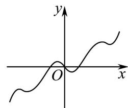
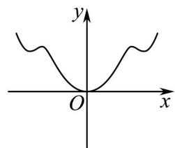
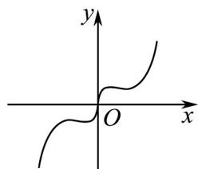
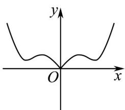

<!-- question-source:start -->
39. 已知 $f(x) = \frac{1}{4} x^2 + \sin \left( \frac{\pi}{2} + x \right)$ ， $f'(x)$ 为 $f(x)$ 的导函数，则 $y = f'(x)$ 的图象大致是（）

A

B

C

<!-- question-source:end -->

![[高中/课堂同步/题库/人教A版高中数学同步讲义(2026)/04_选择性必修第二册/第五章一元函数的导数及其应用/专项训练/专题04_导数的高级应用七大常考题型_高效培优专项训练_数学人教A版2/题型六_sec_07/questions/answers/Q00061330A1.md]]
