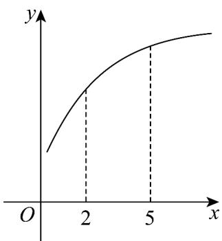
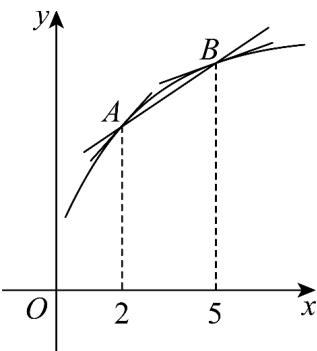

> [!faq]- 《专题01+导数的几何意义有关切线五大常考题型（高效培优专项训练）数学人教A版2019高二选择性必修第二册》官方解析
>
> > [!success]- **【答案】**  A. $\frac{f(5) - f(2)}{3} < f'(2) < f'(5)$ B. $f'(5) < \frac{f(5) - f(2)}{3} < f'(2)$ C. $f^{\prime}(5) < f^{\prime}(2) < \frac{f(5) - f(2)}{3}$ D. $f^{\prime}(2) < \frac{f(5) - f(2)}{3} < f^{\prime}(5)$
>
> > [!note]- **【分析】**
> > 根据给定条件，利用导数的几何意义，借助图形判断得解·
>
> > [!note]- **【解析】**
> > 由导数的几何意义，得 $f'(2)$ 为函数 $f(x)$ 图象在 x=2 处切线的斜率， $f'(5)$ 为函数 $f(x)$ 的图象在 x=5 处切线的斜率，
> >
> > $\frac{f(5) - f(2)}{5 - 2} = k_{AB}$ 为函数 $f(x)$ 图象上点 $A(2,f(2)),B(5,f(5))$ 确定直线的斜率，
> >
> > 观察图象，得 $f'(5) < \frac{f(5) - f(2)}{3} < f'(2)$ .
> >
> > 故选：B
> >
> > 
