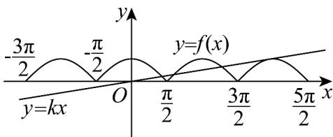
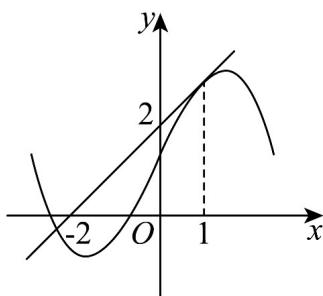

> [!faq]- 《专题01+导数的几何意义有关切线五大常考题型（高效培优专项训练）数学人教A版2019高二选择性必修第二册》官方解析
>
> > [!success]- **【答案】** $\sqrt{2}$
>
> > [!note]- **【分析】**
> > 根据题意，设切点 $A(\alpha, \cos \alpha)$ ，根据斜率公式和导数求斜率化简得到 $\tan \alpha = -\frac{1}{\alpha}$ ，结合两角和的正弦公式，商关系和立方差公式化简所求式子得到答案；
>
> > [!note]- **【解析】**
> > 根据题意，函数 $f(x) = |\cos x|$ 的图像与直线 $y = kx (k > 0)$ 有且仅有4个交点，
> >
> > 且 $\alpha$ 为最大横坐标，可知直线与 $f(x) = |\cos x|$ 的图象在 $x = \alpha$ 处相切，
> >
> > 由图象可知，切点 $\alpha \in \left(\frac{3\pi}{2}, 2\pi\right)$ ，此时 $|\cos x| = \cos x$
> >
> > 
> >
> > 设切点 $A(\alpha, \cos \alpha)$ ，由题意可得 $k = \frac{\cos \alpha}{\alpha}, k = (\cos x)'|_{x = \alpha} = -\sin \alpha$
> >
> > 即 $\frac{\cos\alpha}{\alpha} = -\sin \alpha \Rightarrow \tan \alpha = -\frac{1}{\alpha}$
> >
> > $$
> > \frac {\sin \alpha}{\sin \left(\alpha + \frac {\pi}{4}\right)} = \frac {\sin \alpha}{\frac {\sqrt {2}}{2} (\sin \alpha + \cos \alpha)} = \sqrt {2} \frac {\frac {\sin \alpha}{\cos \alpha}}{\frac {\sin \alpha}{\cos \alpha} + 1} = \sqrt {2} \cdot \frac {\tan \alpha}{\tan \alpha + 1} = \sqrt {2} \left(\frac {- \frac {1}{\alpha}}{- \frac {1}{\alpha} + 1}\right) = \frac {\sqrt {2}}{1 - \alpha}.
> > $$
> >
> > $$
> > \frac {\left(1 - \alpha^ {3}\right)}{\left(1 + \alpha + \alpha^ {2}\right)} = (1 - \alpha)
> > $$
> >
> > 所以 $\frac{\left(1 - \alpha^3\right)\sin\alpha}{\left(1 + \alpha + \alpha^2\right)\sin\left(\alpha + \frac{\pi}{4}\right)} = \frac{\sqrt{2}}{1 - \alpha}\left(1 - \alpha\right) = \sqrt{2}$
> >
> > 故答案为： $\sqrt{2}$
> >
> > 9. 曲线 $y = f(x)$ 在 $x = 1$ 处的切线如图所示，则 $f'(1) - f(1) = (\quad)$
> >
> > 
> >
> > A.0 B.2 C.-2 D.-1
> >
> > 【答案】C
> >
> > 【分析】设切线方程为 $y = kx + b$ ，根据切线方程得到关于 k, b 的方程组，解得 $\left\{\begin{aligned}k &= 1 \\ b &= 2\end{aligned}\right.$ ，进而得出导数值计算求解。
> >
> > 【详解】设曲线 $y = f(x)$ 在 $x = 1$ 处的切线方程为 $y = kx + b$
> >
> > 则 $\left\{ \begin{array}{l} b = 2, \\ -2k + b = 0 \end{array} \right.$ 解得 $\left\{ \begin{array}{l} k = 1, \\ b = 2, \end{array} \right.$
> >
> > 所以曲线 $y = f(x)$ 在 $x = 1$ 处的切线方程为 $y = x + 2$ ，则切线斜率为 1，
> >
> > 所以 $f'(1)=1$ , $f(1)=1+2=3$
> >
> > 因此， $f'(1) - f(1) = 1 - 3 = -2$
> >
> > 故选 **C**.
