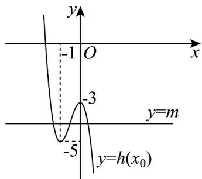
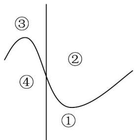

> [!faq]- 《专题01+导数的几何意义有关切线五大常考题型（高效培优专项训练）数学人教A版2019高二选择性必修第二册》官方解析
>
> > [!success]- **【答案】** A. 当 $a = 8$ 时， $f(x)$ 在 $\mathbf{R}$ 上单调递增 B．当 $a \leq 6$ 时， $f(x)$ 有两个极值 C. 若 $f(x)$ 有三个不同零点 $x_{1}, x_{2}, x_{3}$ ，则 $x_{1}x_{2}x_{3} = \frac{3}{2}$ D．过点 $(0,m)$ 且与曲线 $y=f(x)$ 相切的直线恰有3条，则-5<m<-3
>
> > [!note]- **【分析】**
> > 解法一：当 $a = 8$ 时，可得 $f^{\prime}(x) > 0$ 恒成立，即可判断A；但 $a = 6$ 时， $f^{\prime}(x) = 0$ 恒成立，即可判断B；设函数 $f(x) = 2(x - x_1) \cdot (x - x_2) \cdot (x - x_3)$ 展开整理可判断C；利用导数的几何意义求得切线方程，代入点 $(0, m)$ 得 $m = -4x_0^3 - 6x_0^2 - 3$ ，则 $y = m$ 与 $h(x_0) = -4x_0^3 - 6x_0^2 - 3$ 图象有3个不同的交点，利用导数研究 $h(x)$ 的性质，即可判断D.
> >
> > 解法二：当 $a = 8$ 时，可得 $f^{\prime}(x) > 0$ 恒成立，即可判断A；但 $a = 6$ 时， $f^{\prime}(x) = 0$ 恒成立，即可判断B；利用一元三次方程的韦达定理可判断C；根据三次函数切线问题的结论可判断D.
>
> > [!note]- **【解析】**
> > 解法一：
> >
> > 当 $a = 8$ 时， $f'(x) = 6x^2 + 12x + 8 \Rightarrow \Delta = 12^2 - 4 \times 6 \times 8 = -48 < 0 \Rightarrow f'(x) > 0$ 恒成立，
> >
> > 则函数 $f(x)$ 在 $\mathbf{R}$ 上单调递增，故选项 $\mathsf{A}$ 正确；
> >
> > $f^{\prime}(x) = 6x^{2} + 12x + a\Rightarrow \Delta = 12^{2} - 4\times 6\times a > 0\Rightarrow a <   6\Rightarrow f(x)$ 有2个极值，
> >
> > 但 $a = 6$ 时， $\Delta = 0\Rightarrow f^{\prime}(x)$ 0恒成立，
> >
> > 此时函数 $f(x)$ 在 R 上单调递增，无极值，故选项 B 错误；
> >
> > 设函数 $f(x)=2(x-x_{1})\cdot(x-x_{2})\cdot(x-x_{3})$
> >
> > $$
> > \Rightarrow f (x) = 2 x ^ {3} - 2 \left(x _ {1} + x _ {2} + x _ {3}\right) x ^ {2} + 2 \left(x _ {1} x _ {2} + x _ {2} x _ {3} + x _ {1} x _ {3}\right) x - 2 x _ {1} x _ {2} x _ {3}
> > $$
> >
> > $\Rightarrow-2x_{1}x_{2}x_{3}=-3\Rightarrow x_{1}x_{2}x_{3}=\frac{3}{2}$ ，故选项 C 正确；
> >
> > 设切点 $\left(x_0, f(x_0)\right), f'(x) = 6x^2 + 12x + a$
> >
> > 则切线方程为： $y - \left(2x_0^3 +6x_0^2 +ax_0 - 3\right) = \left(6x_0^2 +12x_0 + a\right)\cdot (x - x_0)$
> >
> > 代入点 $(0,m)$ 得： $m=-4x_{0}^{3}-6x_{0}^{2}-3$ ，
> >
> > 过点 $(0,m)$ 且与曲线 $y=f(x)$ 相切的直线恰有3条 $\Leftrightarrow y=m$ 与 $h(x_{0})=-4x_{0}^{3}-6x_{0}^{2}-3$ 图象有3个不同的交点， $h'(x)=-12x_{0}^{2}-12x_{0}\quad0\Rightarrow-1\leq x_{0}\leq0,\quad h'(x)=-12x_{0}^{2}-12x_{0}<0\Rightarrow x_{0}<-1$ 或 $x_{0}>0$ ，
> >
> > 函数 $h(x)$ 在 $(- \infty, -1), (0, +\infty)$ 单调递减， $[-1, 0]$ 上单调递增，且 $h(-1) = -5, h(0) = -3$
> >
> > $\therefore -5 < m < -3$ ，故选项D正确·
> >
> > 
> >
> > 故选：ACD.
> >
> > 解法二：
> >
> > 当 $a = 8$ 时， $f'(x) = 6x^2 + 12x + 8 \Rightarrow \Delta = 12^2 - 4 \times 6 \times 8 = -48 < 0 \Rightarrow f'(x) > 0$ 恒成立，
> >
> > 则函数 $f(x)$ 在 $\mathbf{R}$ 上单调递增，故选项 $\mathsf{A}$ 正确；
> >
> > $f^{\prime}(x) = 6x^{2} + 12x + a\Rightarrow \Delta = 12^{2} - 4\times 6\times a > 0\Rightarrow a <   6\Rightarrow f(x)$ 有2个极值，
> >
> > 但 a = 6 时， $\Delta = 0 \Rightarrow f'(x)$ 0 恒成立，
> >
> > 此时函数 $f(x)$ 在 $\mathbf{R}$ 上单调递增，无极值，故选项 ${}^{\mathrm{B}}$ 错误；
> >
> > 一元三次方程 $a_{3}x^{3} + a_{2}x^{2} + a_{1}x + a_{0} = 0(a_{3}\neq 0)$
> >
> > 韦达定理： $\left\{\begin{aligned}x_{1}+x_{2}+x_{3}&=-\frac{a_{2}}{a_{3}}\\ x_{1}x_{2}+x_{2}x_{3}+x_{1}x_{3}&=\frac{a_{1}}{a_{3}}\end{aligned}\right.$ ，故，选项 C 正确； $x_{1}x_{2}x_{3}&=-\frac{a_{0}}{a_{3}}\quad x_{1}x_{2}x_{3}=-\frac{-3}{2}=\frac{3}{2}$
> >
> > 三次函数切线问题：过三次函数对称中心作切线（有且仅有一条），
> >
> > 则坐标平面被该条切线和三次函数图象分为 $^{4}$ 个区域：
> >
> > 
> >
> > 过①③区域内的点（不含边界）作切线有且仅有 $^{3}$ 条；
> >
> > 过②④区域内的点（不含边界）作切线有且仅有 $^{1}$ 条；
> >
> > 过切线或三次函数上的点（除去对称中心）作切线有且仅有 $^{2}$ 条；
> >
> > $$
> > f ^ {\prime \prime} (x) = 1 2 x + 1 2 = 0 \Rightarrow x = - 1
> > $$
> >
> > 所以函数 $f(x)$ 的对称中心为 $(-1, -a + 1)$ ，
> >
> > 过该点的切线方程为： $y - (-a + 1) = f'(-1)(x + 1) \Rightarrow y = (a - 6)x - 5$ 恒过 $(0, -5)$ ，
> >
> > 而函数 $f(x)$ 恒过 $(0,-3)$ ,
> >
> > 故只有 $-5 < m < -3$ 时，点 $(0, m)$ 落在①③区域内，符合题意，故 $^{\mathrm{D}}$ 正确·
> >
> > 故选 **ACD**.
