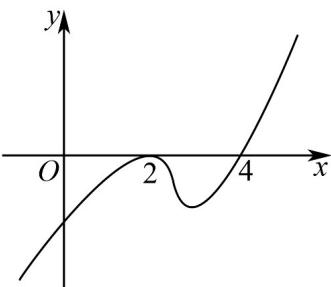

> [!faq]- 《专题02+利用导数研究函数的单调性六大常考题型（高效培优专项训练）数学人教A版2019高二选择性必修第二册》官方解析
>
> > [!success]- **【答案】**  A. $f(x)$ 有2个极值点 B. $f(x)$ 在 $x = 2$ 处取得极大值 C. $f(x)$ 在 $(- \infty, 2)$ 上单调递增 D. $f(x)$ 有极小值，没有极大值
>
> > [!note]- **【分析】**
> > 利用导函数图象确定函数 $f(x)$ 的单调性，再逐项判断即可.
>
> > [!note]- **【解析】**
> > 由图象得，当 $x < 4$ 时， $f'(x) \leq 0$ ，当且仅当 $x = 2$ 时取等号；当 $x > 4$ 时， $f'(x) > 0$ ，函数 $f(x)$ 在 $(- \infty, 4)$ 上单调递减，在 $(4, +\infty)$ 上单调递增，
> >
> > 因此函数 $f(x)$ 有一个极小值，没有极大值，ABC 错误，D 正确.
> >
> > 故选 **D**
