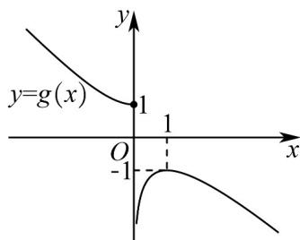

> [!faq]- 《专题02+利用导数研究函数的单调性六大常考题型（高效培优专项训练）数学人教A版2019高二选择性必修第二册》官方解析
>
> > [!success]- **【答案】** C
>
> > [!note]- **【分析】**
> > 设 $g(x) = f(x) - x = \left\{ \begin{array}{l} \ln x - x, x > 0 \\ \mathrm{e}^x - x, x \leq 0 \end{array} \right.$ ，问题可转化为 $g(x)$ 与 $y = a$ 只有1个交点，求导得到其单调性，画出其函数的大致图象，进而数形结合即可得到答案。
>
> > [!note]- **【解析】**
> > 令 $g(x) = f(x) - x = \begin{cases} \ln x - x, & x > 0 \\ \mathrm{e}^x - x, & x \leq 0 \end{cases}$ ，
> >
> > 则 $f(x) - x - a = 0$ 有且只有一个实根，可转化为 $g(x)$ 与 $y = a$ 只有1个交点，
> >
> > 当 $x > 0$ 时， $g(x) = \ln x - x$ ，则 $g'(x) = \frac{1}{x} - 1$
> >
> > 若 $0 < x < 1$ 时， $g'(x) > 0$ ，即 $g(x)$ 在 $x \in (0,1)$ 上单调递增，
> >
> > 若 $x > 1$ 时， $g'(x) < 0$ ，即 $g(x)$ 在 $x \in (1, +\infty)$ 上单调递减；
> >
> > 当 $x \leq 0$ 时， $g(x) = \mathrm{e}^x - x$ ，则 $g'(x) = \mathrm{e}^x - 1 \leq 0$ 恒成立，
> >
> > 故 $g(x) = \mathrm{e}^x - x$ 在 $x \in (-\infty, 0]$ 上单调递减，
> >
> > 又 $g(0) = \mathrm{e}^0 - 0 = 1$ ， $g(1) = \ln 1 - 1 = -1$ ，则 $g(x)$ 的图象大致如下：
> >
> > 
> >
> > 所以要想 $g(x)$ 与 $y = a$ 只有1个交点，则只需 $a = 1$ 或 $a = -1$ ，
> >
> > 故实数 a 的取值范围是 $\left[1, +\infty\right) \cup \left\{-1\right\}$ .
> >
> > 故选 **C**
