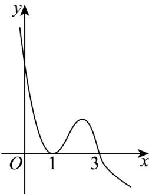

<!-- question-source:start -->
50．已知函数 $y = f(x)$ ，其导函数 $y = f'(x)$ 的图象如图所示，则下列命题中错误的

是（ ）.

A. 函数 $y = f(x)$ 有2个驻点
B. 函数 $y = f(x)$ 在 $x = 1$ 处取得极小值
C. 函数 $y = f(x)$ 有极大值，没有极小值
D. 函数 $y = f(x)$ 在 $(-∞,3)$ 上是严格增函数
<!-- question-source:end -->

![[高中/课堂同步/题库/人教A版高中数学同步讲义(2026)/04_选择性必修第二册/第五章一元函数的导数及其应用/专题02+利用导数研究函数的单调性六大常考题型（高效培优专项训练）数学人教A版2019高二选择性必修第二册/题型五_函数与导函数图象之间的关系/questions/answers/Q00081689A1.md]]
